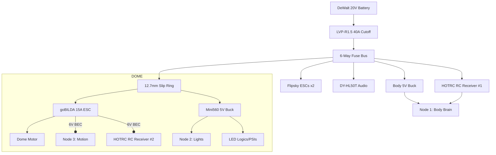

# Wee2-D2: Mr. Baddeley Big Baby Astromech

Welcome to the official repository for **Wee2-D2**, a custom-built astromech droid designed for 501st Legion events. This repository tracks the electrical architecture, firmware configurations, and hardware documentation for the droid's decentralized control system.

## 🛰️ Technical Wiki: Imperial Databank
To view the documented system with a premium, interactive "Mission Control" interface, visit the official Technical Wiki:
👉 **[Wee2-D2 Databank (Wiki)](https://ruzzler.github.io/Wee2-D2/)**

---

## 🚀 Project Overview
Wee2-D2 uses a decentralized architecture across three ESP32 microcontrollers to ensure non-blocking operation of audio, lighting, and mechanical systems. The droid is controlled via **Dual HOTRC DS-600 transmitters** (one for drive, one for dome) for maximum reliability during events.

### 🧠 System Nodes
- **Node 1: Body Brain (Audio & Dispatch)**: ESPHome-based controller for RC signal processing, bank-switching, and audio triggering.
- **Node 2: Dome Lights (WLED)**: Dedicated WLED instance for WS2812 addressable LED light shows with safety current limiting.
- **Node 3: Dome Motion (ESPHome)**: Precise motor control for dome rotation with safety voltage clamping (20V battery to 12V motor).

## 🔋 Master Power Architecture



*   **Main Source**: DeWalt 20V Batteries.
*   **Protection**: [MgcSTEM LVP-R1.5](./docs/electrical/lvp-r15-manual.md) ➔ Main Fuse Bus Bar.
*   **Mission Control**: See the interactive [Electrical Schematic](https://ruzzler.github.io/Wee2-D2/#docs/electrical/electrical-schematic.md).

## 📁 Repository Structure
```text
├── docs/               # Technical Documentation
│   ├── components/     # Bill of Materials (BoM)
│   └── electrical/     # Component Manuals & Power Routing
├── firmware/           # Microcontroller Code
│   ├── node1-body-brain/  # ESPHome: Audio & Signal Dispatch
│   ├── node2-dome-lights/ # WLED: 2D Matrix & Effects
│   └── node3-dome-motion/ # ESPHome: Dome Rotation Control
├── archive/            # Legacy test code
├── index.html          # Imperial Databank Engine (SPA)
└── README.md           # This file
```

## 🦿 Hardware Ecosystem
*   **Control**: 2x [HOTRC DS-600](./docs/electrical/hotrc-ds600-manual.md) (Silent Mode mod).
*   **Drive System**: 2x [Flipsky Mini FSESC 6.7 Pro](./docs/electrical/flipsky-fsesc-67-pro-manual.md) ➔ E-Scooter Hub Motors.
*   **Dome Motion**: [goBILDA 5203 Yellow Jacket](./docs/electrical/cnbtr-slip-ring-manual.md) ➔ [1x15A Motor Controller](./docs/electrical/cnbtr-slip-ring-manual.md).
*   **Audio**: [DY-HL50T Sound Module](./docs/electrical/dy-hl50t-manual.md) (60W Mono).
*   **Power Protection**: [MgcSTEM LVP-R1.5](./docs/electrical/lvp-r15-manual.md) (40A Cutoff).
*   **Lighting**: [GrnWave Circular PSI](./docs/electrical/grnwave-psi-manual.md) (76-LED Inward Spiral).

---

## 🏛️ Local Deployment
To run the Databank engine locally:
1.  Open a terminal in the project root.
2.  Run the local server: `python -m http.server 8000`
3.  Navigate to [http://localhost:8000](http://localhost:8000).
