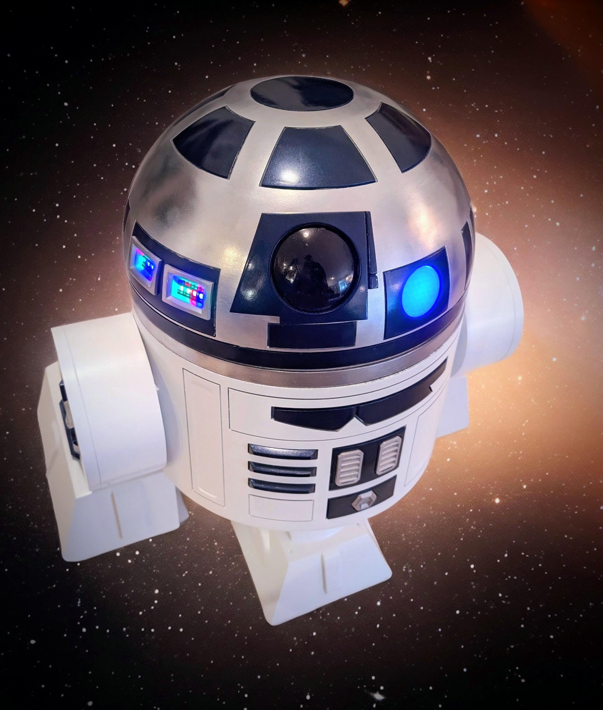

# <i data-lucide="container"></i> Wee2-D2

Welcome to the official repository for **Wee2-D2**. I built this droid in 2025 as an active-duty astromech for the **Badlands Droid Builders** and the **501st Legion's Badlands Garrison**, frequently deploying it to community events. The physical chassis was 3D printed utilizing the acclaimed 3D files created by Mr. Baddeley.

This repository tracks the subsequent electrical architecture, firmware configurations, and custom hardware documentation I use to bring the droid's decentralized control system to life.

## <i data-lucide="book-open"></i> Technical Documentation

To view the documented system with a premium, interactive technical interface, visit the official Project Wiki:
**[Wee2-D2 Project Wiki](https://ruzzler.github.io/Wee2-D2/)**

---

## Project Overview

Wee2-D2 utilizes a decentralized architecture split across three ESP32 microcontrollers. This ensures non-blocking operation between the audio processing, LED lighting, and mechanical drive systems. The droid is piloted via **Dual HOTRC DS-600 transmitters** (one for drive logic, one for dome motion).

### Wireless Bridge (ESP-NOW)

- **Node 1: Dome Motion**: **ESP32-S3 Super Mini** acting as the "Behavioral Master," broadcasting wireless triggers to the body and lights.
- **Node 2: Sound Hub**: **ESP32-S3 Super Mini** managing the **DFPlayer Mini** and drive system telemetry.
- **Node 3: LED Distribution**: Standard **ESP32 Dev Board** running WLED for high-density addressable light matrices.

> [!WARNING]
> **PROJECT SCOPE**: This repository exclusively documents my custom **Electrical Architecture** and **Firmware** ecosystem. It does **not** contain the 3D-printable STL files or mechanical assembly instructions for the droid chassis itself. Please refer to the official Mr. Baddeley Patreon or group hubs for structural files.

## Repository Structure

```text
 docs/ # Technical Documentation
 capabilities/ # Functional guides (Lights, Sounds, Movement)
 architecture/ # System-wide logic (Wiring, UDNS Bus)
 hardware/ # Component Manuals (Raw PDFs)
 maintenance/ # Operational & Safety standards
 bill-of-materials.md # Unified Component Ledger
 firmware/ # Microcontroller Code (ESPHome)
 system/ # Engine (SPA Logic & Styles)
 assets/ # Media Assets
 index.html # HUD (Entry Point)
 README.md # This file
```

## Hardware Ecosystem

- **Piloting**: 2x [HOTRC DS-600](docs/hardware/hotrc-ds600-manual.md) (Silent Mode mod).
- **Drive System**: 2x [Flipsky Mini FSESC 6.7 Pro](docs/hardware/flipsky-fsesc-67-pro-manual.md) feeding L-faster Hub Motors.
- **Dome Motion**: [goBILDA 5203 Yellow Jacket](docs/hardware/gobilda-motor-manual.md) driven by a [1x15A Motor Controller](docs/hardware/gobilda-motor-manual.md).
- **Audio**: [DFPlayer Mini](docs/bill-of-materials.md) triggered via ESP-NOW, feeding a [TPA3118 60W Amp](docs/bill-of-materials.md) and Pyle 3.5" driver.
- **Power Hub**: [MgcSTEM LVP-R1.5](docs/hardware/mgcstem-lvp-r15-manual.md) mapping to a Positive Blade Fuse Box and central Negative Bus Bar.
- **Lighting**: [GrnWave Circular PSIs](docs/hardware/grnwave-psi-manual.md) and custom Cinematic Logic Displays.

---
 **[View Project Changelog](CHANGELOG.md)**