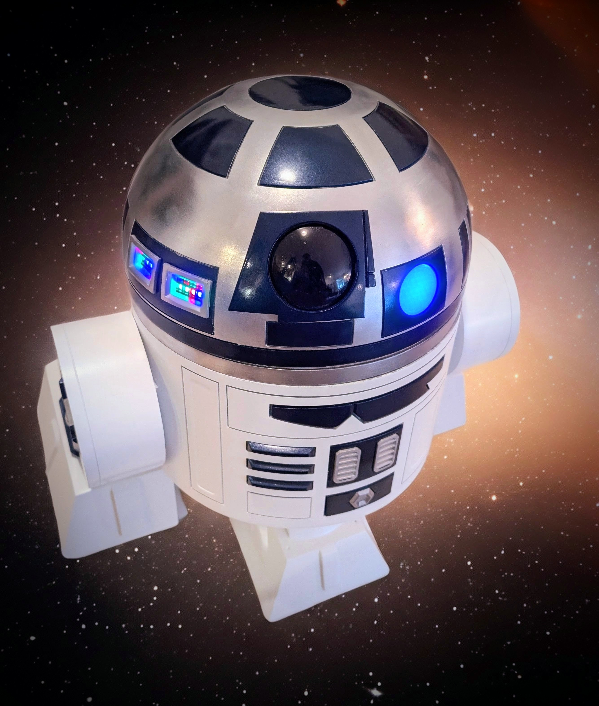

# <i data-lucide="folder-git"></i> Wee2-D2

> **TECHNICAL SPECIFICATIONS** | **SYSTEM: WEE2-D2 PROJECT** | **FIRMWARE BASELINE: v2.12.1**


Welcome to the official repository for **Wee2-D2**, a custom-built, active-duty astromech built in 2025 for use with the **Badlands Droid Builders** and the **501st Legion's Badlands Garrison**. This repository documents the custom **Electrical Architecture**, **firmware** configurations, and custom hardware documentation engineered to bring the droid's decentralized logic to life. The project supports the acclaimed 3D files created by Mr. Baddeley.


---


## <i data-lucide="book-open"></i> Project Wiki

The primary documentation for this project is hosted at the [Project Wiki](https://ruzzler.github.io/Wee2-D2/). Consult the wiki for technical specifications, node mesh architecture, animation framework, app ecosystem, and hardware manuals.


---


## Project Structure

This repository tracks the user-facing wiki. Firmware and control-surface apps live in sibling repositories under the same workspace.


```text
Wiki-Repository/
├── docs/               # Technical Specifications
│   ├── architecture/   # System design, mesh, app ecosystem
│   ├── capabilities/   # Movement, audio, LED, animation framework
│   ├── hardware/       # Component manuals & specs
│   └── maintenance/    # Calibration, OTA, troubleshooting, safety
├── system/             # Wiki CSS & SPA renderer (vanilla, no build)
├── wiki/               # Project overview
├── firmware/           # FROZEN mirror of canonical firmware repo (read-only)
└── README.md           # This file
```

Companion repositories:

- **Firmware** — `Firmware/wee2d2-firmware/` (ESPHome + stock WLED 0.15.4, source of truth for droid behaviour at `v2.12.1`)
- **Web App / PWA** — [`wee2d2-app`](https://github.com/Ruzzler/wee2d2-app) (Web Bluetooth control panel)
- **Android APK Wrap** — [`wee2d2-capacitor`](https://github.com/Ruzzler/wee2d2-capacitor) (Capacitor wrap of the PWA)


---


## <i data-lucide="hard-drive"></i> Hardware Ecosystem

Each link directs to a high-density manual including pinouts and wiring.


- **Piloting**: [HotRC DS-600](docs/hardware/hotrc-ds600-manual.md) (PWM input to Node 1 and Node 2)
- **Drive System**: [Flipsky Mini FSESC 6.7 Pro](docs/hardware/flipsky-fsesc-67-pro-manual.md) driving 2x L-faster FLD-5 [hub motors](docs/hardware/hub-motor-manual.md)
- **Dome Motion**: [goBILDA 5203 Yellow Jacket](docs/hardware/gobilda-motor-manual.md) on Node 1 GPIO 7
- **Audio**: [DY-HV20T audio module](docs/hardware/dy-hv20t-manual.md) (replaced legacy DFPlayer Mini in firmware v2.12.x) → [TPA3118 60W Amp](docs/hardware/tpa3118-amp-manual.md) → Pyle 3.5" speaker
- **Power Grid**: [MgcSTEM LVP-R1.5](docs/hardware/mgcstem-lvp-r15-manual.md) with a central negative bus bar
- **Lighting**: [GrnWave PSI Logics](docs/hardware/grnwave-psi-manual.md) + WS2812B Logic Display matrices driven by Node 3 (stock WLED 0.15.4 on classic ESP32D, 196 LEDs total)


---


## <i data-lucide="book-open"></i> Getting Started

Follow the documentation hierarchically for a stable deployment.


### 1. System Foundations
Understand how the body and dome interact.
- [Interactive Electrical Schematic](docs/architecture/electrical-schematic.md)
- [Node Mesh Architecture](docs/architecture/node-mesh.md)
- [Power Architecture](docs/architecture/power-architecture.md)


### 2. Node Configuration
Catalog the physical pinouts and per-node logic.
- [Node Pinout & Wiring Guide](docs/architecture/node-pinout-guide.md)
- [First-Time Firmware Setup](docs/maintenance/first-time-firmware-setup.md)


### 3. Behaviour & Control
Understand the animation engine and the control surfaces.
- [Animation Framework](docs/capabilities/animation-framework.md)
- [Autonomous Automations](docs/capabilities/automations.md)
- [App & Kiosk Ecosystem](docs/capabilities/dashboard-and-app.md)


### 4. Operation & Safety
Consult before convention deployment.
- [Battery Runtime Guide](docs/maintenance/battery-runtime-guide.md)
- [System Calibration Guide](docs/maintenance/calibration-guide.md)
- [Safety & Maintenance](docs/maintenance/safety-maintenance.md)


---


[View Full Bill of Materials](docs/bill-of-materials.md) | [View Project Changelog](CHANGELOG.md) | [View Firmware Version History](VERSION_HISTORY.md)
