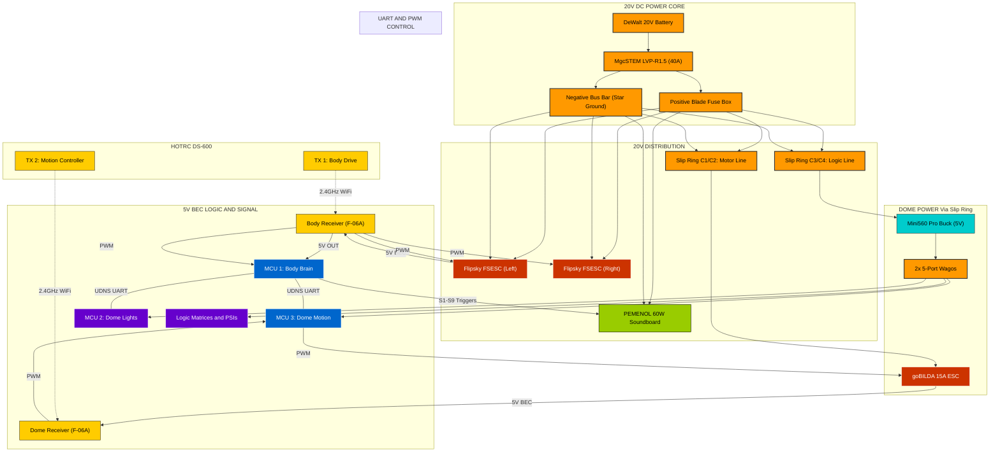

# ⚡ Droid Electrical Schematic

This document provides a high-fidelity visual and technical map of the Wee2-D2 electrical system. 

---

## 🧠 Interactive System Architecture (Mermaid)
> [!TIP]
> **INTERACTIVE INTERFACE**: Click on any component node to instantly decrypt its technical manual in the databank.

---

## 📌 Pinout Lookup Tables

### **MCU 1: Body Controller (ESP32D Dev Board)**
Master controller for sounds and UDNS coordination.

| Component | Pin (GPIO) | Mode | Notes |
| :--- | :---: | :---: | :--- |
| **Status LED** | GPIO2 | Output | Heartbeat Blinker |
| **RC Inputs** | 25, 32, 33 | Input | CH3, CH4, CH5 (PWM) |
| **Sound S1-S9** | 4,5,16,17,18,19,21,22,23 | Output | **Active LOW** (Trigger) |
| **UDNS TX** | GPIO17 | Output | Serial to Dome (Slip Ring Point 3) |
| **UDNS RX** | GPIO16 | Input | Serial from Dome (Slip Ring Point 4) |
| **Web UI** | N/A | WiFi | Port 80 (ESPHome Dashboard) |

### **MCU 3: Motion Controller (ESP32-S3 Super Mini)**
Dedicated controller for 360° dome rotation.

| Component | Pin (GPIO) | Mode | Notes |
| :--- | :---: | :---: | :--- |
| **RC CH1 Input** | GPIO1 | Input | From Receiver #2 (Dome Rotation) |
| **Dome ESC** | GPIO2 | Output | PWM Signal (50Hz) to goBILDA ESC |
| **UDNS TX** | GPIO44 | Output | Serial to Body (via Slip Ring) |
| **UDNS RX** | GPIO43 | Input | Serial from Body (via Slip Ring) |

### **MCU 2: Lighting Controller (ESP32-S3 Super Mini - ESPHome)**
Addressable LEDs using the **UDNS Light Interface**.

| Component | Pin (GPIO) | Mode | Notes |
| :--- | :---: | :---: | :--- |
| **Logics / PSI** | 1, 2, 3 | Output | Neopixel Data Lines |
| **UDNS TX** | GPIO44 | Output | Shared Serial Bus |
| **UDNS RX** | GPIO43 | Input | Shared Serial Bus |
| **Web UI** | N/A | WiFi | Port 80 (Pattern selection) |

---

## 🛡️ Best Practices
*   **Common Ground**: All ESP32 grounds and Buck Converter grounds **MUST** be tied together at a central star-ground point.
*   **Dual-TX Binding**: Ensure the Body Transmitter and Dome Transmitter (HOTRC DS-600 #1 and #2) are bound to their respective receivers on separate IDs.
*   **Signal Cleanliness**: Since the dome motor is a large DC motor, ensure logic wires are positioned away from the main motor leads to prevent EMI noise.
