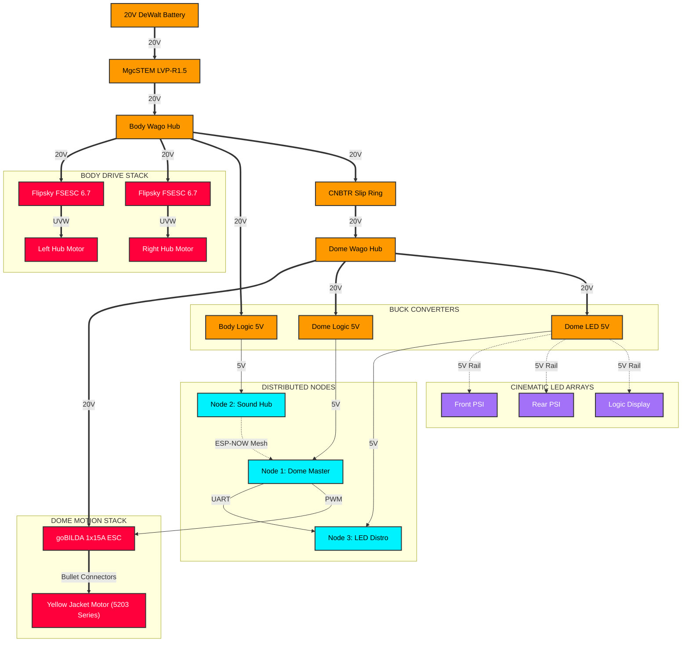

# <i data-lucide="zap"></i> Interactive Electrical Schematic

> **TECHNICAL SPECIFICATIONS** | **SYSTEM: INTERACTIVE INTERCONNECT** | **DOME: NODE 1 MASTER**

The Wee2-D2 project uses a distributed power and logic architecture. This schematic visualizes the "Golden State" of the current build, including the high-current ganged trunk and the wireless ESP-NOW bridge.

---

## Interactive Schematic HUD

*Click on any component (Node, ESC, or Battery) to navigate to its specific technical documentation.*

---

## Technical Interconnect Summary

These pins are verified in the `v2.6.0-Dashboard` firmware sequence.

| Hardware Connection | Node Assignment | GPIO Pin | Protocol |
| :--- | :--- | :---: | :--- |
| **Dome Motor (PWM)** | Node 1: Dome Master | **GPIO 7** | PWM (1050-1950μs) |
| **RC Stick (X-Axis)** | Node 1: Dome Master | **GPIO 4** | Pulse Width |
| **WLED Lighting Bus**| Node 1 (TX Only) | **GPIO 5** | UART (115200) |
| **DFPlayer (Sound)** | Node 2: Sound Hub | **GPIO 43/44** | UART (9600) |
| **Logic LEDs** | Node 3: LED Distro | **GPIO 13** | WS2812B RMT |

> [!IMPORTANT]
> **MESH RECOVERY**: The physical GPIO connections (firmware/production/node-1-dome-motion.yaml:11) are decoupled from the behavior mesh. Even if the ESP-NOW bridge fails, Node 1 remains responsive to raw RC manual override on GPIO 4.

---

[View Master Node Pinout & Wiring Guide](node-pinout-guide.md)