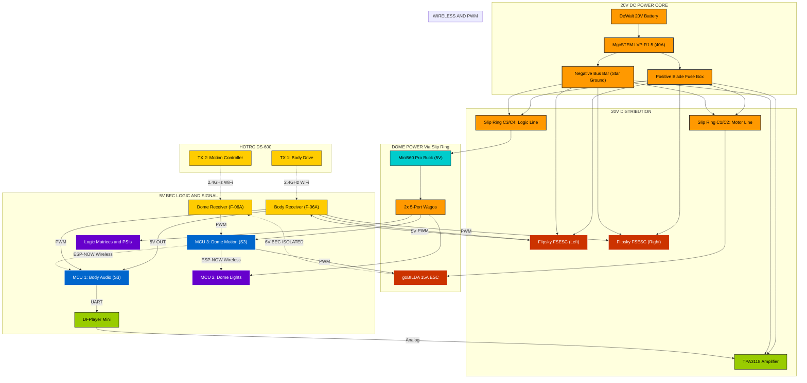

# Droid Electrical Schematic

This document provides a high-fidelity visual and technical map of the Wee2-D2 electrical system. 

---

## <i data-lucide="zap"></i> Interactive Schematic & Pinouts

> [!TIP]
> **INTERACTIVE INTERFACE**: Click on any component node to instantly decrypt its technical manual in the Documentation.

---

## <i data-lucide="graduation-cap"></i> Pinout Lookup Tables

### **<i data-lucide="cpu"></i> MCU 1: Body Audio (ESP32-S3 Super Mini)**
Primary controller for sounds and drive system monitoring.

| Component | Pin (GPIO) | Mode | Notes |
| :--- | :---: | :---: | :--- |
| **Status LED** | GPIO 47 | Output | S3 Internal Neopixel (Logic) |
| **RC CH3-5** | 4, 5, 6 | Input | Behavioral Triggers from RC1 |
| **DFPlayer TX** | GPIO 17 | Output | To DFPlayer RX |
| **DFPlayer RX** | GPIO 16 | Input | From DFPlayer TX (Optional) |
| **Wireless RX** | N/A | ESP-NOW | Listening for Dome triggers |

### **MCU 2: Lighting Controller (ESP32-Dev Board - WLED)**
Dedicated high-density addressable LED matrix controller.

| Component | Pin (GPIO) | Mode | Notes |
| :--- | :---: | :---: | :--- |
| **Front Logic (10x2)** | 18 | Output | Yellow Wire |
| **Rear Logic (12x2)** | 19 | Output | Yellow/Black Striped |
| **Front PSI** | 21 | Output | Green Wire |
| **Back PSI** | 22 | Output | White Wire |
| **UDNS RX (Bus)** | 16 | Input | Serial Command In |
| **Web UI** | N/A | WiFi | Port 80 (Pattern selection) |

### **MCU 3: Motion Controller (ESP32-S3 Super Mini)**
Dedicated controller for 360° dome rotation and behavior broadcasting.

| Component | Pin (GPIO) | Mode | Notes |
| :--- | :---: | :---: | :--- |
| **RC CH1 Input** | GPIO 4 | Input | From Receiver #2 (Steering) |
| **Dome ESC** | GPIO 7 | Output | PWM Signal to goBILDA ESC |
| **Wireless TX** | N/A | ESP-NOW | Broadcasting to Body/WLED |
| **Slip Ring C5** | N/A | Reserved | UNUSED / FUTURE EXPANSION |
| **Slip Ring C6** | N/A | Reserved | UNUSED / FUTURE EXPANSION |

---

## Best Practices
* **Common Ground**: All ESP32 grounds, Receiver grounds, and ESC signal grounds **MUST** be tied together at a central star-ground point.
* **Dual Drive: Parallel Signal Isolation**: The drive system uses two Flipsky Mini 6.7 Pro ESCs. Because the remote is in **Mode 1 (Mixed)**, each ESC receives its own PWM/PPM signal independently. To prevent ground loops, **only ESC 1** provides power and a ground reference to the receiver; **ESC 2** is connected via the **Signal Pin only**.
* **Signal Cleanliness**: Since the dome motor is a large DC motor, ensure logic wires are positioned away from the main motor leads to prevent EMI noise.
* **BEC Isolation**: When using the goBILDA 15A ESC, isolate the Red (6V) wire if the logic bus is already powered by a 5V source. The Black (GND) must remain connected for signal reference.
