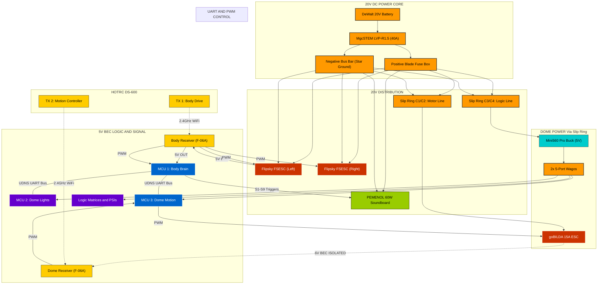

# ⚡ Droid Electrical Schematic

This document provides a high-fidelity visual and technical map of the Wee2-D2 electrical system. 

---

## 🧠 Interactive System Architecture (Mermaid)
> [!TIP]
> **INTERACTIVE INTERFACE**: Click on any component node to instantly decrypt its technical manual in the databank.

---

## 📌 Pinout Lookup Tables

### **MCU 1: Body Controller (ESP32D 38-pin Board)**
Master controller for sounds and UDNS coordination.

| Component | Physical Label | Pin (GPIO) | Notes |
| :--- | :---: | :---: | :--- |
| **Status LED** | D2 | GPIO2 | Heartbeat Blinker |
| **RC CH3 Input** | D25 | GPIO25 | Trigger A (Grey/Blk) |
| **RC CH4 Input** | D33 | GPIO33 | Trigger B (Blue/Blk) |
| **RC CH5 Input** | D32 | GPIO32 | Bank Switch (Purple/Blk) |
| **Sound S1-S9** | D4, D5... | 4,5,26,27,18,19,21,22,23 | **Active LOW** Trigger Pins |
| **UDNS TX** | TX2 | GPIO17 | To Dome (Yellow/Black) |
| **UDNS RX** | RX2 | GPIO16 | From Dome (Green/Black) |

### **MCU 2: Lighting Controller (ESP32-Dev Board - WLED)**
Dedicated high-density addressable LED matrix controller.

| Component | Pin (GPIO) | Mode | Notes |
| :--- | :---: | :---: | :--- |
| **Front Logic (10x2)** | 18 | Output | Yellow Wire |
| **Rear Logic (12x2)** | 19 | Output | Yellow/Black Striped |
| **Front PSI** | 21 | Output | Green Wire |
| **Back PSI** | 22 | Output | White Wire |
| **UDNS RX (Bus)** | 16 | Input | Serial Command In |
| **Web UI** | N/A | WiFi | Port 80 (Pattern selection) |

### **MCU 3: Motion Controller (ESP32-Dev Board)**
Dedicated controller for 360° dome rotation and UDNS dispatch.

| Component | Pin (GPIO) | Mode | Notes |
| :--- | :---: | :---: | :--- |
| **RC CH1 Input** | GPIO 4 | Input | From Receiver #2 (Steering) |
| **Dome ESC** | GPIO 7 | Output | PWM Signal to goBILDA ESC |
| **UDNS TX** | GPIO 17 | Output | Serial to Body (Yellow/Black) |
| **UDNS RX** | GPIO 16 | Input | Serial from Body (Green/Black) |

---

## 🛡️ Best Practices
*   **Common Ground**: All ESP32 grounds, Receiver grounds, and ESC signal grounds **MUST** be tied together at a central star-ground point.
*   **Dual Drive: Parallel Signal Isolation**: The drive system uses two Flipsky Mini 6.7 Pro ESCs. Because the remote is in **Mode 1 (Mixed)**, each ESC receives its own PWM/PPM signal independently. To prevent ground loops, **only ESC 1** provides power and a ground reference to the receiver; **ESC 2** is connected via the **Signal Pin only**.
*   **Signal Cleanliness**: Since the dome motor is a large DC motor, ensure logic wires are positioned away from the main motor leads to prevent EMI noise.
*   **BEC Isolation**: When using the goBILDA 15A ESC, isolate the Red (6V) wire if the logic bus is already powered by a 5V source. The Black (GND) must remain connected for signal reference.
