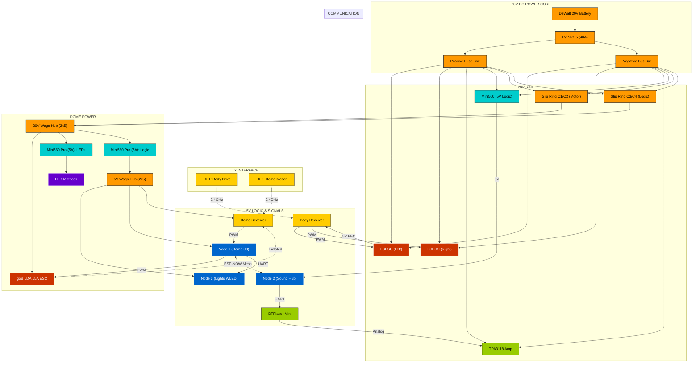

# Droid Electrical Schematic

This document provides a high-fidelity visual and technical map of the Wee2-D2 electrical system.

---

## Interactive Schematic

> [!TIP]
> **INTERACTIVE INTERFACE**: Click on any component node to instantly access its technical manual or firmware specification.

---

## Wiring & Pinout Reference

For detailed wire colors, GPIO assignments, and hardware-specific triggers, consult the master reference:

> [!IMPORTANT]
> **[Master Node Pinout & Wiring Guide](node-pinout-guide.md)**
> This document contains the absolute source of truth for all node wiring, BEC isolation, and star-grounding practices.

---

## Engineering Best Practices

- **Star-Grounding**: All system grounds **MUST** terminate at the central Negative Bus Bar to prevent signal noise.
- **Slip Ring Isolation**: The 20V Dome Motor line and 20V Dome Logic line must remain isolated through the slip ring.
- **ESC BEC Isolation**: When using multiple speed controllers, only one BEC (typically ESC 1) should provide 5.1V logic power to the receiver.

---

[View Power Architecture](power-architecture.md)