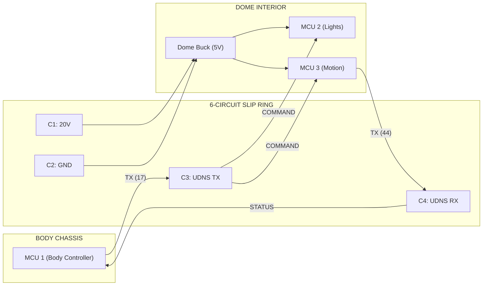

# 📑 UDNS Wiring Guide: Wee2-D2 Serial Bus

This guide details the physical interconnects for the **Unified Droid Nervous System (UDNS)**, ensuring 100% synchronization across the rotating slip ring.

---

## 🛰️ Slip Ring Pinout (6-Circuit)
The slip ring is the "Spinal Cord" of the droid. Every signal must be shared across this rotating joint.

| Circuit | Function | Color (Typical) | Wire Gauge | Destination |
| :--- | :--- | :--- | :--- | :--- |
| **C1** | **VCC (20V DC)** | Red | 16-18 AWG | To Dome Buck Converter |
| **C2** | **GND (Common)** | Black | 16-18 AWG | To All MCU Grounds (Star Ground) |
| **C3** | **UDNS TX (Out)** | Yellow/White | 22-24 AWG | Body Master -> Dome Slaves (Command) |
| **C4** | **UDNS RX (In)** | Green/Blue | 22-24 AWG | Dome Slaves -> Body Master (Telemetry) |
| **C5** | **Spare/Aux** | Brown | 22-24 AWG | Optional Signal (RC Bypass) |
| **C6** | **Spare/Aux** | Gray | 22-24 AWG | Optional Signal |

---

## 🧠 Controller Interconnects

### **1. Body Master (ESP32D Dev Board)**
The "Body Controller" sends commands up the spine to the dome controllers.
*   **UDNS TX (GPIO17)**: Connect to Slip Ring **Circuit 3**.
*   **UDNS RX (GPIO16)**: Connect to Slip Ring **Circuit 4**.
*   **Power**: 5V from Body Buck Converter.

### **2. Dome Slaves (ESP32-S3 Mini x2)**
The S3 Super Minis are wired in "Parallel" (Multidrop) on the command bus.
*   **UDNS RX (GPIO43)**: Connect BOTH S3 RX pins to Slip Ring **Circuit 3** (The incoming TX from the body).
*   **UDNS TX (GPIO44)**: Connect ONE S3 TX pin to Slip Ring **Circuit 4** (The outgoing telemetry line).
*   **Power**: 5V from Dome Buck Converter (via Slip Ring C1/C2).

---

## ⚡ Wiring Schematic (Command Bus)

---

## ⚠️ Critical Wiring Rules
1.  **Common Ground**: You **MUST** ensure the Ground (C2) from the battery connects to every single ESP32. If the ground is broken at the slip ring, your serial signals will become "garbage" data and the droid will glitch.
2.  **Current Rating**: The 20V power (C1) can carry up to **10A** in your slip ring. This is perfect for the dome motor and LEDs. Use a thicker gauge (16-18) for the power lines to prevent voltage drop.
3.  **Signal Separation**: Keep the Serial wires (C3/C4) away from the high-power lines if possible to avoid magnetic interference (EMI) that could scramble your commands.
