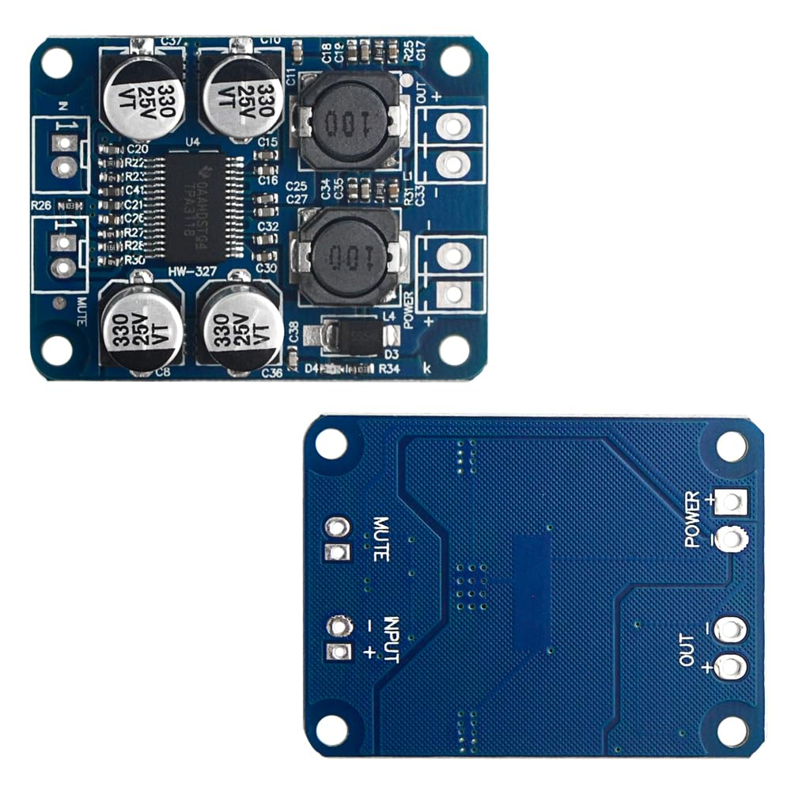

# <i data-lucide="volume-2"></i> Node 1: Sound Hub Spec
> **ESPHome Firmware** | **ESP32-S3 Super Mini**

The **Sound Hub** acts as the localized audio management and drive monitoring system for Wee2-D2. It listens for **ESP-NOW** behavioral triggers from the Dome Motion master and translates them into serial commands for the **DFPlayer Mini**.

| **Hardware Node** | ESP32-S3 Super Mini |
| :--- | :--- |
| **Logic Framework** | ESPHome (esp-idf) |
| **Primary Function** | Audio Hub (ESP-NOW Slave) |
| **Source Code** | [`node-1-sound-hub.yaml`](../../firmware/production/node-1-sound-hub.yaml) |
| **Visual ID (Logic)** |  |
| **Visual ID (Audio)** |  |

## <i data-lucide="rocket"></i> Core Purpose
*   **ESP-NOW Wireless Link**: Low-latency behavioral synchronization with the Dome Master.
*   **DFPlayer UART Control**: High-fidelity track triggering and volume management via serial.
*   **RC Signal Monitoring**: Decodes PWM from RC1 for localized drive fail-safes.
*   **Telemetry Projection**: Reports audio status and battery health back to Home Assistant.
*   **OTA Updates**: Fully support Over-The-Air updates via the [Imperial Databank Dashboard](docs/maintenance/network-ota-guide.md).

##  Pinout Configuration
| Connection | ESP32 Pin | Logic |
| :--- | :---: | :--- |
| **RC CH3-5 (In)** | 4, 5, 6 | Trigger Pulse Data (Input) |
| **DFPlayer TX** | GPIO 17 | Serial Command Out |
| **DFPlayer RX** | GPIO 16 | Serial Status In (Optional) |
| **Wireless Link** | N/A | ESP-NOW Behavioral Sync |
| **Status LED** | GPIO 47 | Internal Neopixel (Logic) |

##  Configuration
The configuration is defined in [`body-brain.yaml`](./body-brain.yaml). 

### Auto-Mode Logic
When the `current_bank` is set to `3` (Bank 4), an internal 1-second interval timer decrements. When it reaches zero, a random trigger is fired and the timer is reset to a value between 5s and 15s.
