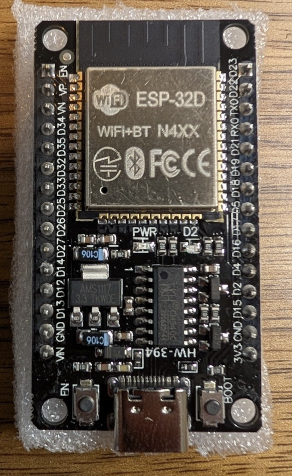

# 💡 MCU 2: Lighting Controller (WLED)
> **WLED Firmware** | **ESP32 Dev Board (Standard)**

This MCU is dedicated to controlling the WS2812 addressable LED system in the dome using **WLED**.

| **Hardware Node** | ESP32-Dev Board (Standard) |
| :--- | :--- |
| **Logic Framework** | WLED |
| **Primary Function** | Addressable LEDs |
| **Source Code** | [🌐 WLED Web Installer](https://install.wled.me/) |
| **Visual ID** |  |
| **UDNS RX (Bus)** | **GPIO 16** (Yellow/Black) |
| **UDNS TX (Bus)** | **GPIO 17** (Green/Black) |
| **Status LED** | **GPIO 2** |

## 🔋 Power Management & Safety
> [!IMPORTANT]
> To protect the Mini560 5V buck converter from overheating or melting during high-intensity light shows (e.g., full-white flashes), the WLED brightness limiter **MUST** be enabled.

- **Current Limit**: Clamp to **3500mA** in the WLED "LED Preferences" menu.
- **Hardware**: Mini560 5V Buck Converter powered by 20V from the slip ring.

| Device | LED Type | Qty | wire Color | Pin (GPIO) |
| :--- | :--- | :---: | :---: | :---: |
| **Front Logic** | WS2812B | 20 | 🟨 Yellow | **18** |
| **Rear Logic** | WS2812B | 24 | 🟨/⬛ Yellow/Blk | **19** |
| **Front PSI** | GrnWave | 76 | 🟩 Green | **21** |
| **Back PSI** | GrnWave | 76 | ⬜ White | **22** |

> [!CAUTION]
> **VOLTAGE SENSITIVITY**: The GrnWave PSI boards use micro 2020-size LEDs that are extremely sensitive. **Do not exceed 5.0V**. Powering them from the 6V BEC of the motor controller will cause immediate failure. Use the dedicated **Mini560 5V Regulator**.

## ⚙️ WLED 2D Configuration
To achieve cinematic logic scrolling:
1.  **Front Logic**: In WLED 2D settings, set as a matrix of **10 Width x 2 Height**.
2.  **Rear Logic**: Set as a matrix of **12 Width x 2 Height**. Even though they are physically separated, treating them as one 12x2 strip in WLED allows animations to flow across both windows.

- **Total Pixels**: ~200 LEDs.
- **PSI Boards**: 2x Grnwave PSI boards.
- **Support Strips**: 1x 12-pixel strip, 2x 5-pixel strips.

## 🛰️ UDNS Serial Integration
This MCU receives high-level commands from the Body Controller via the slip ring.
*   **Data Signal**: Connect the Yellow/Black wire (Body TX) to **GPIO 16**.
*   **Response Signal**: Connect the Green/Black wire (Body RX) to **GPIO 17**.
*   **Protocol**: 115200 Baud, 8N1. WLED can be configured to react to serial JSON payloads for synchronized animations.

## 🔗 Useful Links
- [WLED Documentation](https://kno.wled.ge/)
- [Grnwave PSI Setup Guide](https://grnwave.com/)
