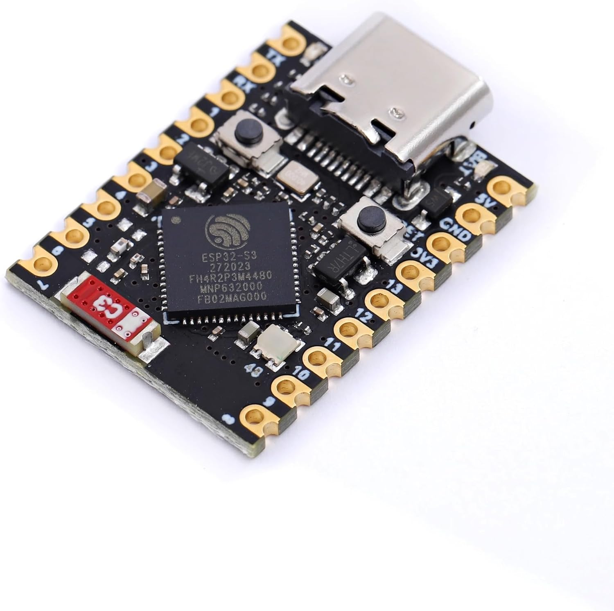

# <i data-lucide="cpu"></i> Node 2: Sound Hub

> **TECHNICAL SPECIFICATIONS** | **ROLE: AUDIO + WEB DASHBOARD + APP RELAY** | **BOARD: ESP32-S3 SUPER MINI**

Node 2 is the audio + UI hub. It drives the [DY-HV20T audio module](../hardware/dy-hv20t-manual.md), hosts the [web control dashboard](../capabilities/web-control-dashboard.md), receives operator commands from the [mobile app](app-ecosystem.md) via the BLE bridge, and acts as a relay back to Node 1 for anything that needs the dome to react.

---

## At a Glance

- **Board**: ESP32-S3 Super Mini
- **Powered from**: 5V Mini560 Pro buck (body logic rail)
- **Communicates with**: Node 1 (wireless, bidirectional) + DY-HV20T (wired serial)
- **Physical location**: body / lower chassis, near the DY-HV20T + TPA3118 amp

---

## What's Wired to Which Pin

| GPIO | What's connected | Role |
| :---: | :--- | :--- |
| **GPIO 12** | DY-HV20T RX | Audio command line out |
| **GPIO 13** | DY-HV20T TX | Audio status line in |
| **GPIO 5** | RC button (CH3) | Volume Up |
| **GPIO 4** | RC button (CH4) | E-Stop |
| **GPIO 6** | RC button (CH5) | Volume Down |
| **GPIO 47** | On-board status LED | Heartbeat / state indicator |

---

## What It Does

- **Plays sounds.** Receives a sound request (RC button, dashboard click, app tap, or relayed performance trigger from Node 1), looks up the file, and tells the DY-HV20T to play it.
- **Hosts the web dashboard.** A glassmorphic operator panel served at `wee2d2-sound-hub.local` for live control without needing the app.
- **Bridges the BLE app.** Commands the app sends over Bluetooth land here for execution (volume changes, sound triggers, display mode).
- **Monitors Node 1.** Listens for Node 1's heartbeat and surfaces its status to the dashboard so you can see at a glance if the dome brain is alive.
- **Relays to Node 1.** Operator commands that affect dome motion or lighting (animation triggers, lighting preset overrides, dome speed) get forwarded wirelessly to Node 1.

---

## Safety

- **Volume cap (26/30)** — every input that can change volume is clamped to a hard maximum that protects the speaker driver.
- **E-Stop fan-out** — pressing E-Stop on Node 2 stops audio immediately AND tells Node 1 to stop dome motion in the same call. Single press, both subsystems halted.
- **Boot audio init** — Node 2 always re-initialises the audio module on boot before accepting any sound triggers, so a brief power blip never leaves the speaker silent under "commands succeeded" telemetry.

---

## Maintenance & Debug

- **Wireless dashboard**: `wee2d2-sound-hub.local` on your local Wi-Fi.
- **USB-C** for wired log access.
- **"Audio silent but commands succeeded"** — most common cause is the boot-time audio init never ran. A clean reboot restores it.
- **"Mesh bridge lost"** — the dashboard's Node 1 status badge goes stale after ~15 s of no heartbeat. Node 1 keeps running autonomously even when this happens.

---

[View DY-HV20T Manual](../hardware/dy-hv20t-manual.md) | [View Audio System](../capabilities/audio-system.md) | [View Web Control Dashboard](../capabilities/web-control-dashboard.md) | [View BLE App Control](ble-bridge.md)
