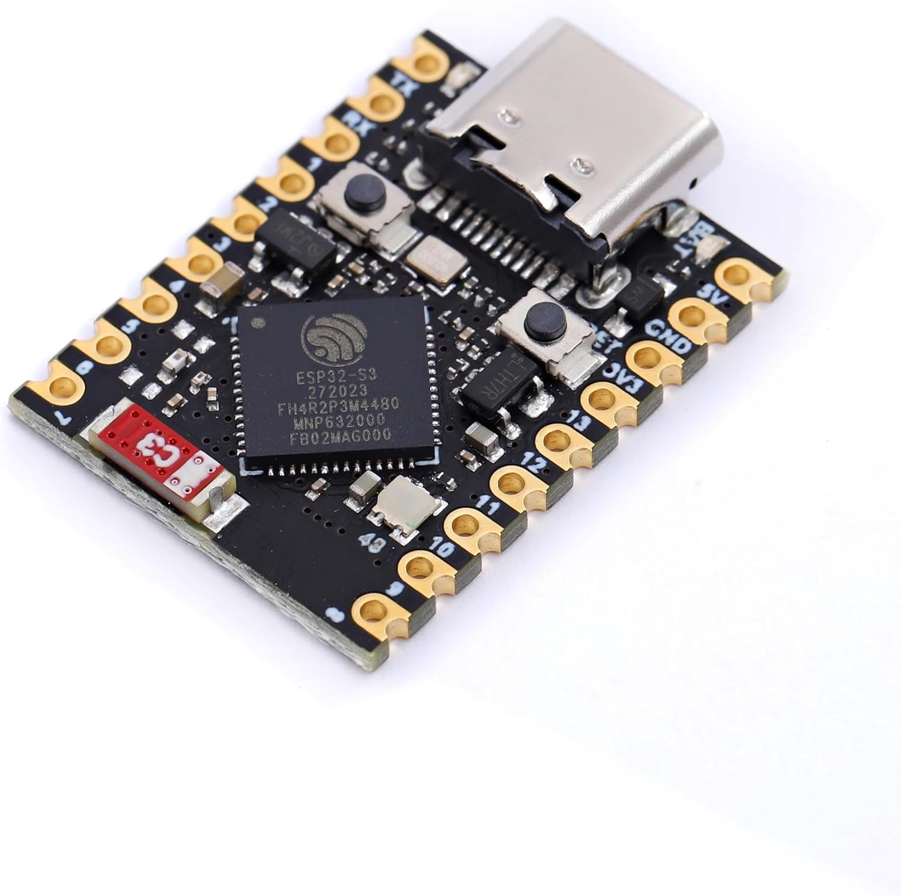

# 🦾 Node 3: Dome Motion
> **ESPHome Firmware** | **ESP32-S3 Super Mini**

The **Dome Motion** node serves as the behavioral heart of Wee2-D2. It manages precision dome rotation via a goBILDA 15A ESC and orchestrates all droid actions by broadcasting **ESP-NOW** triggers to the Sound and LED hubs.

| **Hardware Node** | ESP32-S3 Super Mini |
| :--- | :--- |
| **Logic Framework** | ESPHome (esp-idf) |
| **Primary Function** | Behavioral Master & Motion |
| **Source Code** | [🗄️ `node-3-dome-motion.yaml`](../../firmware/production/node-3-dome-motion.yaml) |
| **Visual ID** |  |

## 🚀 Core Features
*   **Behavioral Orchestration**: Broadcasts wireless triggers for audio tracks (Body) and light patterns (Dome) using the low-latency **ESP-NOW** protocol.
*   **RC Passthrough / Interrupt**: Decodes CH1 from RC2 (GPIO 4) for manual dome control, overriding autonomous routines.
*   **Dynamic Scripts**: Includes built-in behaviors for "Scan Patrol," "Mood Logic," and "Sync Dance."
*   **Safety Interlocks**: 
    *   **Boot/Shutdown Stop**: Forces speed to 0% on controller power cycles.
    *   **Auto-Detach**: Motor controller signal detaches after 5s of inactivity to prevent hum.

## 🔌 Pinout Configuration
| Connection | ESP32 Pin | Wire Color | Logic |
| :--- | :---: | :--- | :--- |
| **RC CH1 (Steer)** | GPIO 4 | 🟨 Yellow | PWM Input (Pull-Down) |
| **Wireless TX** | N/A | ESP-NOW | Broadcast Master Link |
| **ESC PWM Out** | GPIO 7 | ⬜/🟦 White/Blue | PWM Output to goBILDA |
| **Rear PSI** | GPIO 5 | ⬜ White | RMT LED Output (WS2182B) |
| **Front PSI** | GPIO 6 | 🟩 Green | RMT LED Output (WS2182B) |

## ⚙️ ESP32-S3 Engineering Implementation
The following hardware-specific constraints are unique to the S3 Super Mini platform and were identified during the domehub integration audit:

### 1. S3-Specific Constraints (Critical)
*   **RMT Memory Allocation**: The ESP32-S3 has exactly 192 RMT symbols for timing. When driving dual WS2812 strips, `rmt_symbols: 96` must be explicitly set for each strip to split hardware memory equally and prevent CPU timeout crashes.
*   **GPIO 9 Flash Conflict**: GPIO 9 is internally tied to the board's flash memory data bus. Do not use this pin for high-speed PWM or data signals as it will interfere with the bootloader.
*   **Wi-Fi Antenna Saturation**: To prevent disconnects on the compact Super Mini board, transmit power is limited to `8.5dB`.

### 2. General ESPHome & Electrical Standards
*   **Update Intervals**: ESPHome's default 60-second update interval is overridden to `50ms` for the `pulse_width` sensor to ensure real-time RC responsiveness.
*   **Log Noise Suppression**: A `delta: 20.0` filter is applied to the RC stick sensor to ignore micro-fluctuations in the analog signal.
*   **Common Grounds**: All components in the dome MUST share a common ground reference with the ESP32 for reliable data transmission.
*   **Signal Stabilization**: `mode: INPUT_PULLDOWN` is used on the RC stick's GPIO pin to prevent floating signals and jitter.
