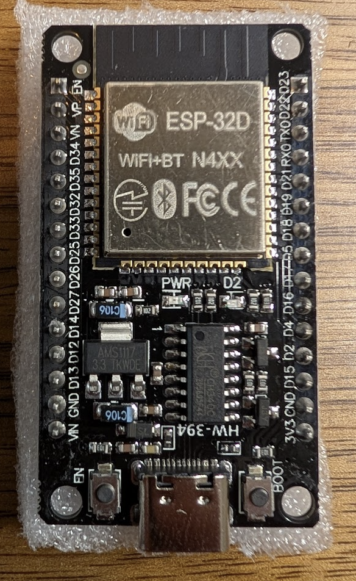

# <i data-lucide="lightbulb"></i> Node 3: LED Hub

> **TECHNICAL SPECIFICATIONS** | **ROLE: ADDRESSABLE LED DRIVER** | **BOARD: ESP32D DEVKIT (CLASSIC ESP32)** | **RUNS: STOCK WLED**


Node 3 is the dedicated lighting controller. It runs **stock WLED** (the popular open-source LED firmware) on a classic single-core ESP32D board and drives all four addressable LED strips on the dome. Node 3 takes simple lighting instructions over a single wire from Node 1; it does not run any custom Wee2-D2 code itself — only WLED plus a curated set of cinematic presets.


---


## At a Glance

- **Board**: ESP32D DevKit (classic ESP32 — not the same chip family as Nodes 1 + 2)
- **Firmware**: stock WLED 0.15.4
- **Powered from**: 5V from the dedicated dome LED buck converter
- **Communicates with**: Node 1 (wired, one-way)
- **Physical location**: dome, above the slip ring


---


## What's Wired to Which Pin

| GPIO | What's connected | Role |
| :---: | :--- | :--- |
| **GPIO 17** | Front PSI strip | 76 LEDs |
| **GPIO 16** | Rear PSI strip | 76 LEDs |
| **GPIO 18** | Front Logic Display | 20 LEDs (10x2 matrix) |
| **GPIO 19** | Rear Logic Display | 24 LEDs (12x2 matrix) |
| **GPIO 3 (RX0)** | Command line from Node 1 | Wired one-way input |

Total **196 addressable LEDs** across 4 strips.


---


## Physical LED Layout

How the LEDs are physically arranged and wired on each panel. Index numbers
are 1-based (LED 1 = the strip's data-in end). The Update Center's Lights tab
mirrors these shapes so a live effect appears where the LEDs actually are.


### Front PSI / Rear PSI — round GrnWave boards (76 LEDs each)

Each PSI is a round, high-density **GrnWave** board that drops into a 3.5"
sensor port. The LEDs are packed in an offset (hex-style) pattern filling the
disc; the index runs as a spiral — **D1 on the outer edge, spiralling inward to
D76 near the centre**.

```
            ·  ·  ·  ·  ·
         ·  ·  ·  ·  ·  ·  ·
       ·  ·  ·  ·  ·  ·  ·  ·        round disc, 76 LEDs
      ·  ·  ·  · (··) ·  ·  ·  ·      outer ring = low indices
       ·  ·  ·  ·  ·  ·  ·  ·         centre      = high indices
         ·  ·  ·  ·  ·  ·  ·          (D1 → D76 spirals inward)
            ·  ·  ·  ·  ·
```

Real board (with per-LED labels D1–D76): see
[`assets/grnwave-psi-logic.jpg`](../../assets/grnwave-psi-logic.jpg).


### Front Logic — GPIO 18 — 20 LEDs · ONE strip · TWO 5×2 windows

The front logic is **two separate windows**, but wired as a single continuous
20-LED strip (easier to wire). Data enters at LED 1 in the **right window,
bottom-right**, snakes right-to-left across the bottom of both windows, then
left-to-right across the top.

```
          LEFT WINDOW                RIGHT WINDOW
  top     11  12  13  14  15         16  17  18  19  20
  bot     10   9   8   7   6          5   4   3   2   1   ◄── data in (LED 1)

  path: 1→5 (right win bottom, R→L) ─► 6→10 (left win bottom, R→L)
        ─► up ─► 11→15 (left win top, L→R) ─► 16→20 (right win top, L→R)
```


### Rear Logic — GPIO 19 — 24 LEDs · ONE 12×2 window

One wide window. Data enters at LED 1, **top-left**, runs left-to-right across
the top, drops down, then runs right-to-left across the bottom.

```
  top      1   2   3   4   5   6   7   8   9  10  11  12   ◄── data in (LED 1)
  bot     24  23  22  21  20  19  18  17  16  15  14  13

  path: 1→12 (top, L→R) ─► down ─► 13→24 (bottom, R→L)
```


> **Note for differing builds:** the Update Center stores this arrangement per
> droid (preview only — never sent to the controller). In its Lights → Physical
> layout editor the shapes above are: PSI = `spiral`, Front Logic =
> `grid 10x2 g2 br` (two windows, start bottom-right), Rear Logic =
> `grid 12x2` (start top-left).


---


## What It Does

- **Holds 15 cinematic presets** (Idle, Alert Red, Disco, Imperial March, etc.). See the [LED System](../capabilities/led-system.md) page for the full catalog.
- **Responds to preset changes from Node 1** within ~10 ms — fast enough to feel synchronized with sound + motion.
- **Provides a standalone web UI** for tuning presets, palettes, and segment maps without needing to redeploy firmware.


---


## Safety

- **Global brightness cap (~30%)** — enforced inside WLED itself AND on every command Node 1 sends. Protects the GrnWave PSI matrices from over-voltage.
- **Dedicated LED power rail** — separate buck converter from the logic rail. A heavy LED draw cannot sag the ESP32 supply.
- **All grounds tied** at the dome distribution point — required for clean LED data signals.


---


## Maintenance & Debug

- **Web UI**: browse to Node 3's IP address (look it up in your router's DHCP list, or use `wled-dome.local` if mDNS works on your network). All preset tuning happens here.
- **micro-USB** on the ESP32D DevKit for serial monitor access. Note: the USB-Serial chip shares a pin with the command line from Node 1, so keep USB unplugged during normal operation.
- **Flickering** — usually a sag on the LED 5V rail under full brightness. Verify the rail holds steady.
- **One strip dark** — check that strip's data wire and ground at the dome distribution hub.


---


[View LED System Guide](../capabilities/led-system.md) | [View WLED Configuration Guide](../maintenance/wled-configuration-guide.md) | [View Master Schematic](electrical-schematic.md)
