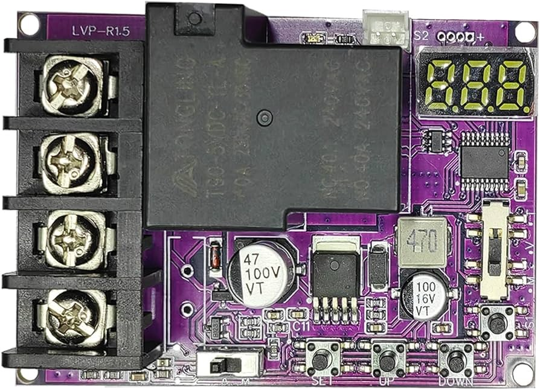
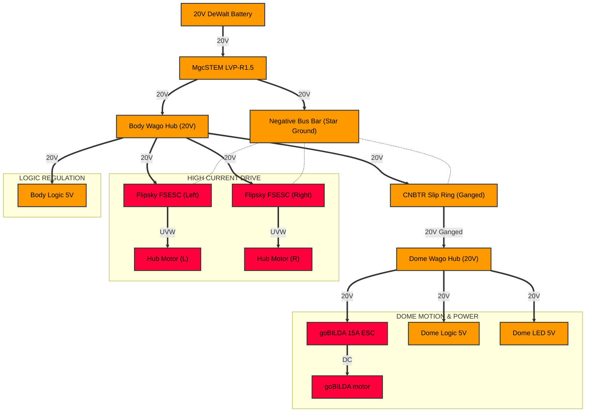

# <i data-lucide="zap"></i> Power Architecture

> **TECHNICAL SPECIFICATIONS** | **SYSTEM: POWER GRID** | **MODEL: GANGED TRUNK 20V**

This guide explains the electrical design of the Wee2-D2 project. It covers the high-current ganged trunk, voltage regulation, and grounding strategies used across all microcontroller nodes.

---

## Interactive Power Distribution (PDN)

*Click on any component (Battery, LVP, or Buck) to navigate to its specific technical documentation.*

---

## System Overview (Ganged Trunk Strategy)

The droid uses a central **20V Battery Hub** that distributes power through a ganged trunk line. This strategy doubles the current-carrying capacity by using paired wires, reducing resistive losses through the slip ring.

| Component | Voltage | Protection | Role |
| :--- | :--- | :---: | :--- |
| **Battery** | 20V (18.5V Nom) | MgcSTEM LVP | Primary Trunk Power |
| **Body Logic Rail** | 5V DC | Mini560 Pro | Node 2 & RC Sensors |
| **Dome Logic Rail** | 5V DC | Mini560 Pro | Node 1 & Dome Motor Logic |
| **Dome LED Rail** | 5V DC | Mini560 Pro | Node 3 & Cinematic Visuals |

---

## Voltage Regulation & Filtering

The power grid uses three specialized **Mini560 Pro** buck converters to stabilize the logic rails. These converters are chosen for their high efficiency and low electromagnetic interference (EMI).

### 1. The Body Logic Rail
This rail powers the Sound Hub (Node 2) and the DFPlayer Mini. It is isolated from the motor rails to prevent audio popping.
- **Output**: 5.0V @ 5A Peak
- **Location**: Mounted near the central Negative Bus Bar.

### 2. The Dome Logic Rail
This rail powers the Dome Master (Node 1) and the dome rotation controller.
- **Output**: 5.0V @ 5A Peak (firmware/production/node-1-dome-motion.yaml:24)
- **Signal**: Powers the GPIO 7 PWM signal for the dome motor.

### 3. The Dome LED Rail
Dedicated to the addressable LED arrays (WS2812B). This rail provides high current for bright visual patterns.
- **Output**: 5.01V @ 5A Peak (firmware/production/node-1-dome-motion.yaml:137)
- **Reflow**: This rail is physically decoupled from the Node 1 logic rail to prevent "voltage brownouts" during bright flashes.

---

## Slip Ring Utilization (Circuits 1–6)

To minimize signal noise, the project uses the **Dual-Circuit Isolation Strategy** through the slip ring. Logic-level signals (UART/PWM) are kept separate from the high-current motor trunks.

| Circuit | Function | Current | Protocol |
| :--- | :--- | :---: | :--- |
| **C1 / C2** | **20V Positive (Paired)** | 10A | Raw Trunk |
| **C3 / C4** | **Ground (Paired)** | 10A | Common - |
| **C5 / C6** | **RESERVED** | — | Future Expansion |

---

## Safety Standards & LVC

The project includes an **Active Low Voltage Cutoff (LVP)** system that monitors the trunk voltage. If the battery dips below **17.5V**, the system enters a "Safe Shutdown" mode (firmware/production/node-1-dome-motion.yaml:425).

- **Protection**: Prevents deep discharge of Li-ion batteries.
- **Recovery**: Requires a fresh 20V battery swap and a system power cycle.
- **Manual Overpass**: None. Safety is hard-wired at the LVP module.

---

[View Master Schematic](electrical-schematic.md) | [View Battery Runtime Guide](../maintenance/battery-runtime-guide.md)