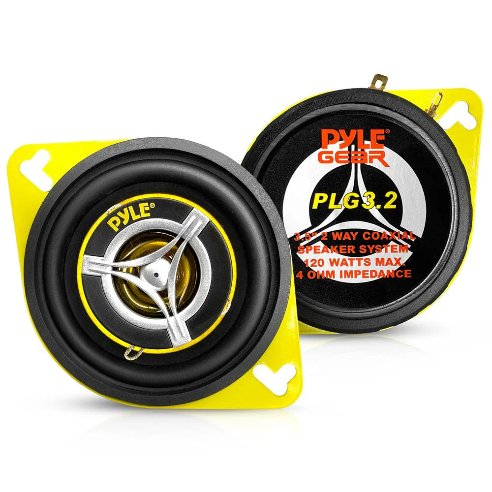
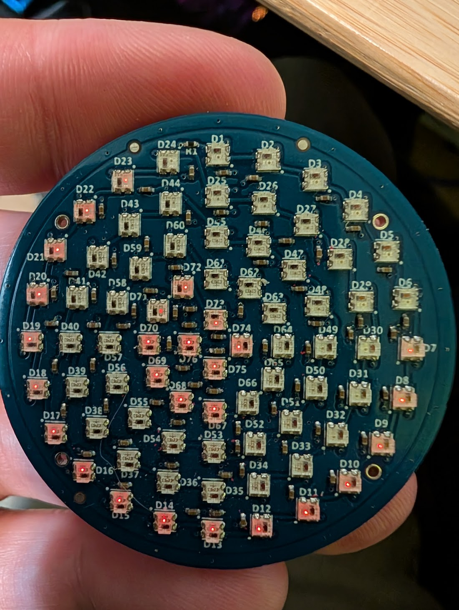
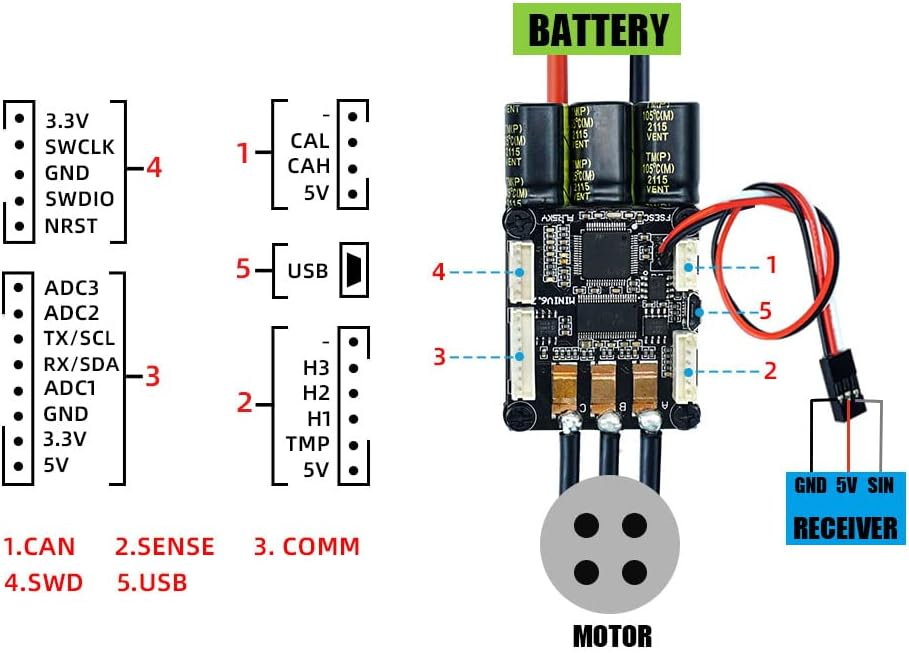
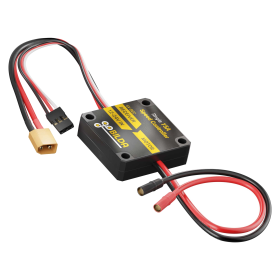

# 🏛️ IMPERIAL DATABANK: BILL OF MATERIALS (BOM)
> **TECHNICAL REPOSITORY** | **SERIAL: B0M-WEE2D2-v1.2**

A comprehensive list of hardware used in the Wee2-D2 project, organized by system tier. Click on any thumbnail in the **Visual ID** column to enlarge it.

## 🧠 Brains & Control
| Component | Qty | Specifications | Visual ID |
| :--- | :---: | :--- | :---: |
| **Node 1: Body Brain** | 1 | ESP32-Dev Board; primary signal dispatch |  |
| **Node 2: Dome Lights** | 1 | ESP32-S3 Super Mini; **WLED** Matrix Controller |  |
| **Node 3: Dome Motion** | 1 | ESP32-S3 Super Mini; Precision Dome Rotation |  |
| [HOTRC DS-600](hardware/hotrc-ds600-manual.md) | 2 | 6-CH Transmitter (Silent Mod) | [PDF](hardware/hotrc-ds600-manual.pdf) |
| [HOTRC F-06A Receivers](hardware/hotrc-f06a-manual.md) | 2 | 6-CH PWM Output @ 9600 Baud | [PDF](hardware/hotrc-f06a-manual.pdf) |

## 🔋 Power & Protection
| Component | Qty | Specifications | Visual ID |
| :--- | :---: | :--- | :---: |
| **DeWalt 20V Battery** | 1 | 4.0Ah / 80Wh (18.5V - 21.0V) | [Guide](maintenance/battery-runtime-guide.md) |
| [MgcSTEM LVP-R1.5](hardware/mgcstem-lvp-r15-manual.md) | 1 | 40A LVC; **17.5V** Safety Floor | [PDF](hardware/mgcstem-lvp-r15-manual.pdf) |
| **Fuse Bus Bar** | 1 | Multi-circuit safety distribution | - |
| **Buck Converters** | 2 | Mini560 (Dome) & Standard (Body) 5V Units | - |
| [CNBTR Slip Ring](hardware/cnbtr-slip-ring-manual.md) | 1 | 12.7mm Bore, 6-Circuit @ 10A/ch |  |

## 🔊 Audio & Lights
| Component | Qty | Specifications | Visual ID |
| :--- | :---: | :--- | :---: |
| [PEMENOL 60W Soundboard](hardware/pemenol-60w-voice-manual.md) | 1 | DY-HL50T; Integrated 60W AMP |  |
| **Pyle 3.5" Car Speaker**| 1 | 60W RMS / 4 Ohm High-Output Driver |  |
| **WS2812B Logic Arrays** | 1 | Addressable LED matrices (Front & Rear) | - |
| [GrnWave Circular PSI](hardware/grnwave-psi-manual.md) | 2 | 76x WS2812B-2020 LEDs (**5V ONLY**) |  |

## ⚙️ Mechanical / Drive
| Component | Qty | Specifications | Visual ID |
| :--- | :---: | :--- | :---: |
| [Flipsky Mini FSESC 6.7 Pro](hardware/flipsky-fsesc-67-pro-manual.md) | 2 | 70A Cont / 200A Peak, VESC 6.6 base |  |
| [L-faster FLD-5 Hub Motor](hardware/hub-motor-manual.md) | 2 | 200W, 24V, 900 RPM Brushless Drive |  |
| [goBILDA 1x15A ESC](hardware/gobilda-motor-manual.md) | 1 | 12-24VDC, 15A Cont PWM Controller |  |
| [goBILDA 5203 Motor](hardware/gobilda-motor-manual.md) | 1 | 117 RPM (12V Hub) Yellow Jacket Gearmotor | - |

---

> [!TIP]
> **INTEGRITY CHECK**: If visual IDs are missing, please reference the [Unified Droid Nervous System](architecture/unified-nervous-system.md) overview for interior body layout photos.
