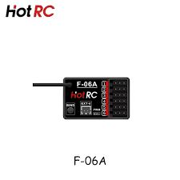
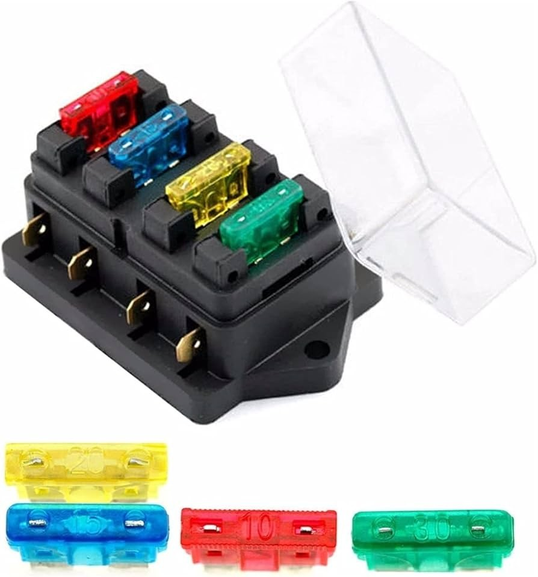
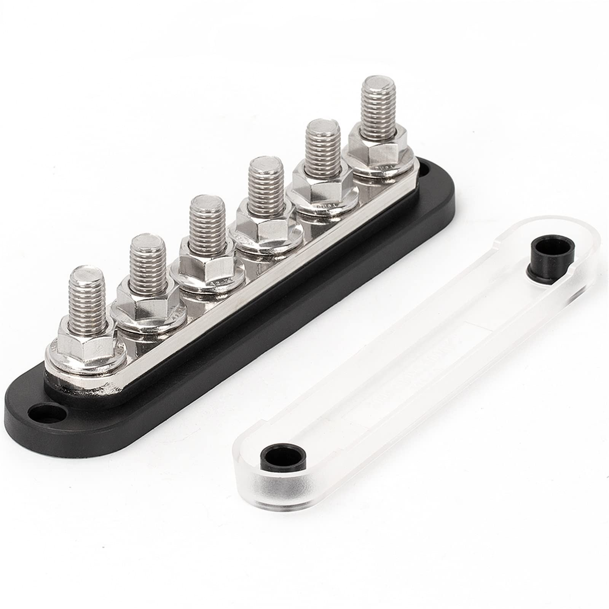
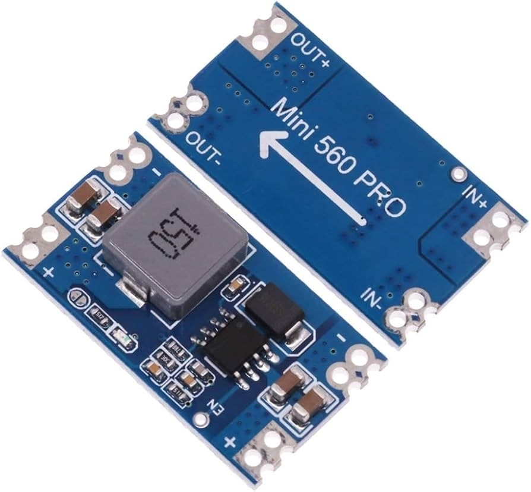
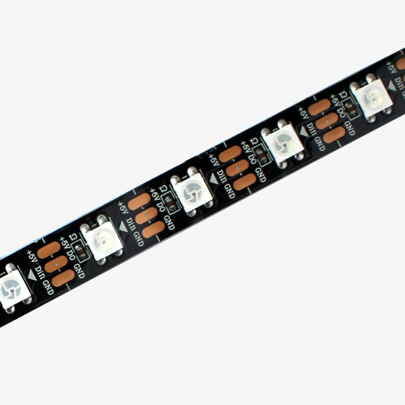
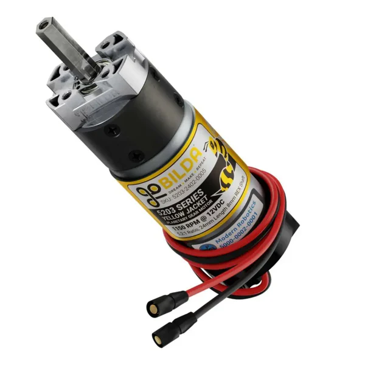

# <i data-lucide="graduation-cap"></i> Bill of Materials (BOM)

A comprehensive list of hardware used in the Wee2-D2 project, organized by system tier. Click on any thumbnail in the **Visual ID** column to enlarge it.

## Brains & Control

| Component | Qty | Specifications | Visual ID |
| :--- | :---: | :--- | :--- |
| [Node 1: Sound Hub](architecture/node-1-sound-hub-spec.md) | 1 | ESP32-S3 Super Mini; Audio & Drive Sync |  |
| [Node 2: LED Distribution](architecture/node-2-led-distribution-spec.md) | 1 | ESP32-Dev Board; **WLED** Matrix Controller |  |
| [Node 3: Dome Motion](architecture/node-3-dome-motion-spec.md) | 1 | ESP32-S3 Super Mini; Behavioral Master |  |
| [HOTRC DS-600](hardware/hotrc-ds600-manual.md) | 2 | 6-CH Transmitter (Silent Mod) [PDF](hardware/hotrc-ds600-manual.pdf) |  |
| [HOTRC F-06A Receivers](hardware/hotrc-f06a-manual.md) | 2 | 6-CH PWM Output @ **115200 Baud (UDNS)** [PDF](hardware/hotrc-f06a-manual.pdf) |  |

## Power & Protection

| Component | Qty | Specifications | Visual ID |
| :--- | :---: | :--- | :---: |
| DeWalt 20V Battery | 1 | 4.0Ah / 80Wh (18.5V - 21.0V) | [Guide](maintenance/battery-runtime-guide.md) |
| [MgcSTEM LVP-R1.5](hardware/mgcstem-lvp-r15-manual.md) | 1 | 40A LVC; **17.5V** Safety Floor [PDF](hardware/mgcstem-lvp-r15-manual.pdf) |  |
| Positive Blade Fuse Box | 1 | 20V Positive distribution to main electronics |  |
| Negative Bus Bar | 1 | Central Star Ground connection point |  |
| Mini560 Pro Buck Converter | 2 | 20V to 5V Step-Down (Dome Logic & LEDs) |  |
| 5-Port Wago Connectors | 4 | 2x Dome (Power Trunk), 2x Body (Signal/GND) | - |
| [CNBTR Slip Ring](hardware/cnbtr-slip-ring-manual.md) | 1 | 12.7mm Bore, 6-Circuit @ 10A/ch (2x Ganged) |  |

## Audio & Lights

| Component | Qty | Specifications | Visual ID |
| :--- | :---: | :--- | :---: |
| [DFPlayer Mini](hardware/dfplayer-mini-spec.md) | 1 | UART-Controlled MP3 Module; Node 3 Broadcast Sink |  |
| [TPA3118 Amplifier](capabilities/lights-and-sounds/audio-system.md) | 1 | 60W Mono Amp (Body Hub); Direct analog from DFPlayer |  |
| [Pyle 3.5" Car Speaker](capabilities/lights-and-sounds/audio-system.md) | 1 | 60W RMS / 4 Ohm High-Output Driver |  |
| [WS2812B Logic Arrays](capabilities/lights-and-sounds/led-system.md) | 1 | Addressable LED matrices (Front & Rear) |  |
| [GrnWave Circular PSI](hardware/grnwave-psi-manual.md) | 2 | 76x WS2812B-2020 LEDs (**5V ONLY**) |  |

## 3D Print & Mechanical Assembly

| Component | Qty | Specifications | Visual ID |
| :--- | :---: | :--- | :---: |
| [Flipsky Mini FSESC 6.7 Pro](hardware/flipsky-fsesc-67-pro-manual.md) | 2 | 70A Hardware (Throttled to **15A Software**) |  |
| [L-faster FLD-5 Hub Motor](hardware/hub-motor-manual.md) | 2 | 200W, 24V, 900 RPM Brushless Drive |  |
| [goBILDA 1x15A ESC](hardware/gobilda-motor-manual.md) | 1 | 12-24VDC, 15A Cont PWM Controller |  |
| [goBILDA 5203 Motor](hardware/gobilda-motor-manual.md) | 1 | 117 RPM (12V Hub) Yellow Jacket Gearmotor |  |

---

> [!NOTE]
> **TECHNICAL REPOSITORY**: For detailed wiring and signal paths, please refer to the [Interactive Electrical Schematic](architecture/electrical-schematic.md).