# <i data-lucide="shopping-cart"></i> Bill of Materials

> **TECHNICAL SPECIFICATIONS** | **SYSTEM: HARDWARE PROCUREMENT** | **BOM v2.12.1**

This document catalogs the verified hardware stack for the Wee2-D2 project. All components are selected for architectural parity with the `v2.12.1` firmware sequence.

Click any thumbnail in the **Visual ID** column to enlarge it. Component names link to dedicated manuals where one exists.

---

## Microcontroller Nodes

The droid runs a distributed mesh of ESP32-S3 boards. Inter-node sync is wireless (ESP-NOW), with one UART JSON bridge from Node 1 to Node 3 for LED preset pushes.

| Channel | Component | Qty | Role | Visual ID |
| :--- | :--- | :---: | :--- | :---: |
| **Node 1 — Dome Brain** | [ESP32-S3 DevKitC-1 (N4R2)](architecture/node-1-dome-motion.md) | 1 | Animation framework, dome PWM, ESP-NOW relay, WLED UART bridge |  |
| **Node 2 — Sound Hub** | [ESP32-S3 Super Mini](architecture/node-2-sound-hub.md) | 1 | DY-HV20T audio, web dashboard, BLE bridge, heartbeat monitor |  |
| **Node 3 — LED Hub** | [ESP32D DevKit (classic)](architecture/node-3-led-distribution.md) | 1 | Stock WLED 0.15.4, 4 LED strips (196 px total) |  |
| **Interface** | CP2102 Serial Adapter | 1 | Wired flashing fallback | — |

---

## Drive & Motion Hardware

Body locomotion uses two direct-drive hub motors. Dome rotation uses a planetary gearmotor on a brushed PWM controller.

| Category | Component | Qty | Specification | Visual ID |
| :--- | :--- | :---: | :--- | :---: |
| **Dome Motor** | [goBILDA 5203 Yellow Jacket](hardware/gobilda-motor-manual.md) | 1 | 117 RPM @ 12V, planetary gearbox | 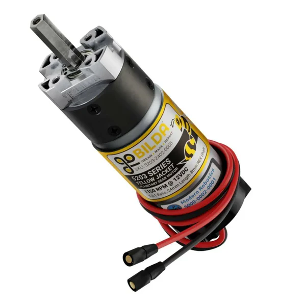 |
| **Dome ESC** | [goBILDA 1x15A](hardware/gobilda-motor-manual.md) | 1 | Brushed PWM, 30V max | 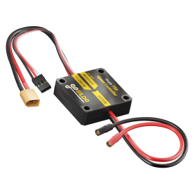 |
| **Body Drive** | [L-faster FLD-5 Hub Motor](hardware/hub-motor-manual.md) | 2 | 5" direct drive, 200W, 24V | 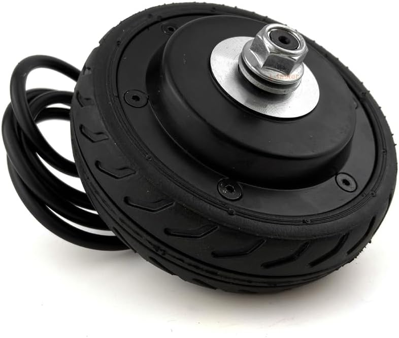 |
| **Body ESC** | [Flipsky Mini FSESC 6.7 Pro](hardware/flipsky-fsesc-67-pro-manual.md) | 2 | VESC, 70A peak, software-clamped to 15A | 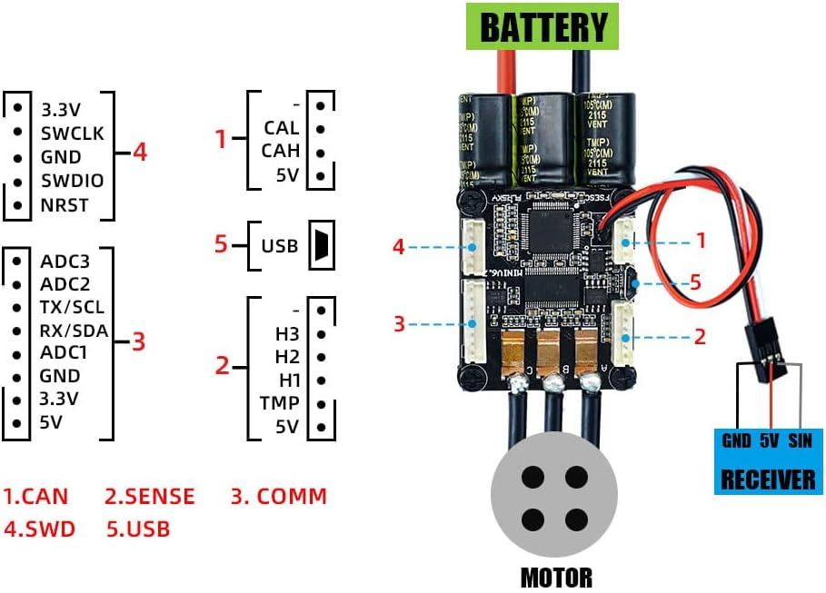 |

---

## Power & Regulation

A 20V DeWalt trunk feeds the body. A ganged trunk through the slip ring delivers 20V to the dome, where dedicated buck converters drop it to 5V for logic and LEDs.

| Circuit | Component | Qty | Specification | Visual ID |
| :--- | :--- | :---: | :--- | :---: |
| **Main Power** | DeWalt 20V Battery | 1 | 4Ah / 6Ah / 9Ah Li-ion (18.5–21.0V) | — |
| **Protection** | [MgcSTEM LVP-R1.5](hardware/mgcstem-lvp-r15-manual.md) | 1 | 40A LVC, 17.5V safety floor | 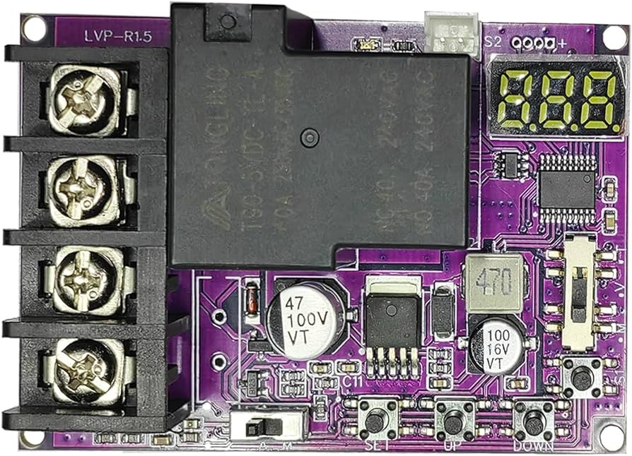 |
| **Positive Fuse Box** | Blade Fuse Box | 1 | 20V positive distribution |  |
| **Star Ground** | Negative Bus Bar | 1 | Central ground reference | 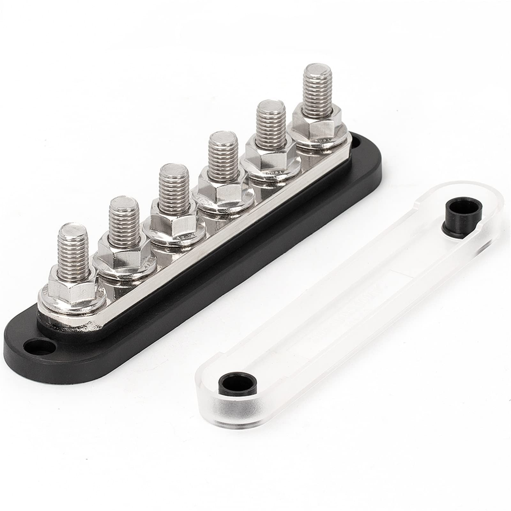 |
| **Regulation** | Mini560 Pro 5A Buck | 3 | Body logic + dome logic + dome LED rails | 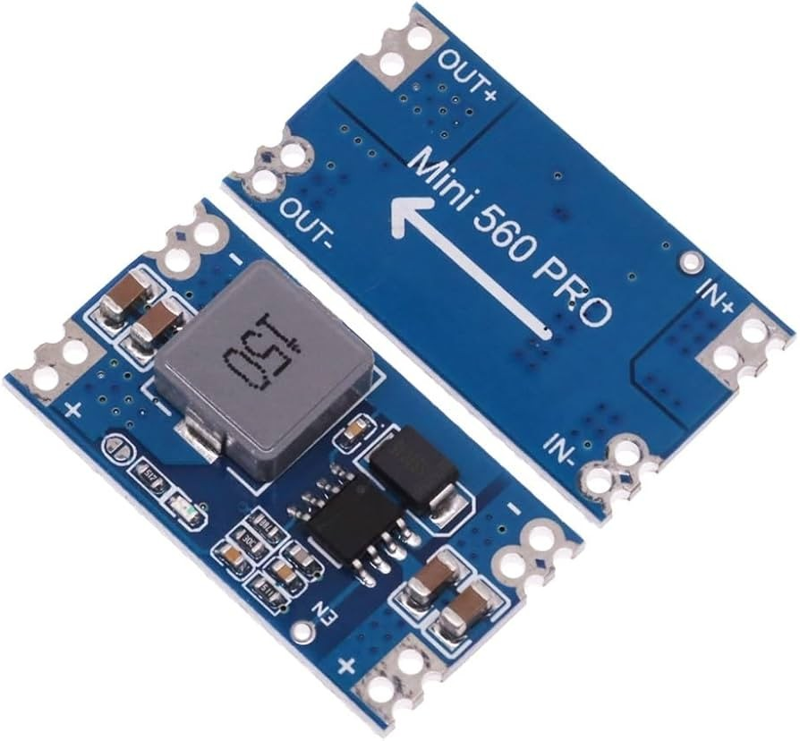 |
| **Bus Dist.** | 5-Port Wago Hub | 2 | Dome power trunk (positive + ground, ganged) | — |
| **Slip Ring** | [CNBTR 6-Circuit](hardware/cnbtr-slip-ring-manual.md) | 1 | 12.7 mm bore, 10A/ch (2x ganged for trunk) | 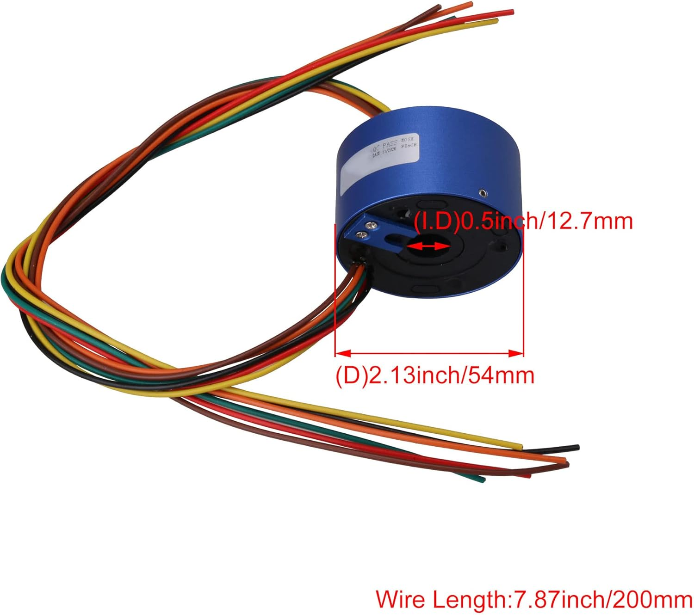 |

---

## Audio & Lighting

Cinematic output runs through specialized LED arrays + a 60W Class-D audio chain. Sound triggers originate on Node 1 and relay to Node 2 over ESP-NOW.

| Category | Component | Qty | Specification | Visual ID |
| :--- | :--- | :---: | :--- | :---: |
| **Audio Module** | [DY-HV20T](hardware/dy-hv20t-manual.md) | 1 | 9600-baud UART, plays MP3 by SD path (firmware v2.12.x; replaced legacy DFPlayer Mini) | 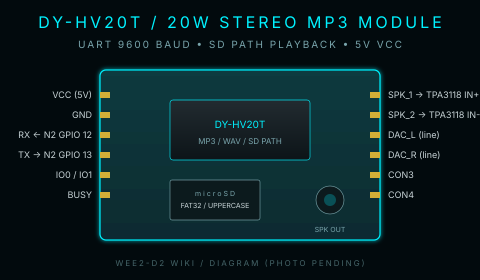 |
| **Amplifier** | [TPA3118 60W](hardware/tpa3118-amp-manual.md) | 1 | Mono Class-D in PBTL mode | 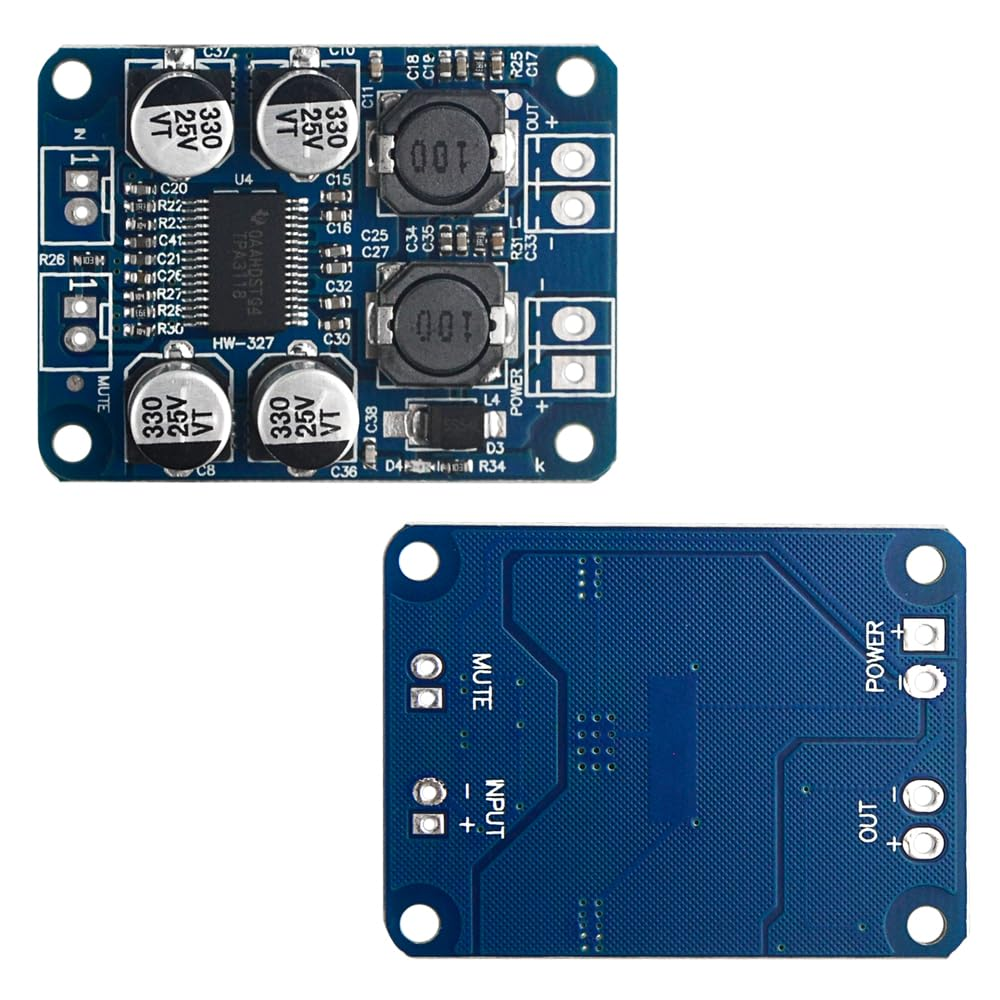 |
| **Speaker** | [Pyle 3.5" Driver](capabilities/audio-system.md) | 1 | 60W RMS, 4 Ohm full-range | 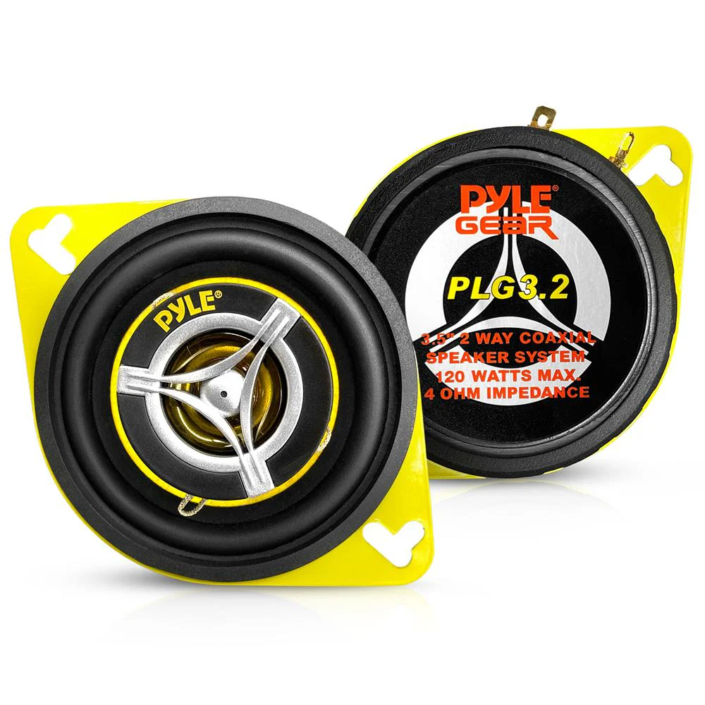 |
| **Logic Display** | [WS2812B Logic Arrays](capabilities/led-system.md) | 2 | Front 10x2 (20 px), rear 12x2 (24 px); Node 3 GPIO 18/19 | 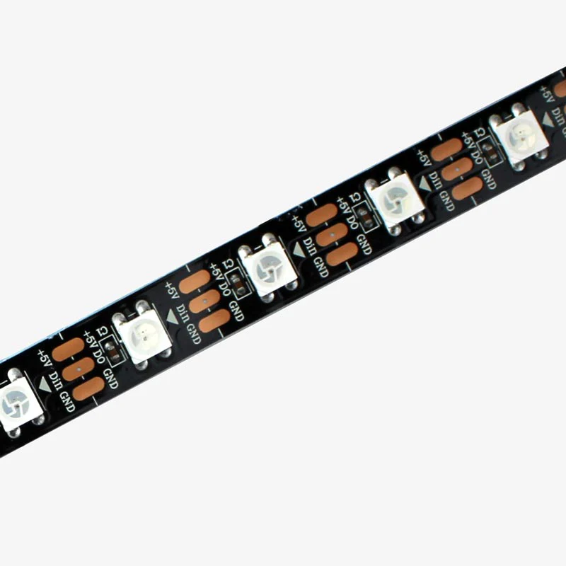 |
| **PSI** | [GrnWave PSI Logics](hardware/grnwave-psi-manual.md) | 2 | 76x WS2812B-2020 per ring (5V only); Node 3 GPIO 16/17 | 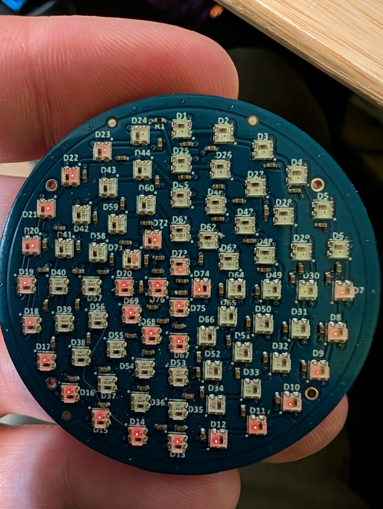 |

---

## Radio Control

The piloting layer uses dual HOTRC DS-600 transmitters paired to dedicated F-06A receivers. Body drive and dome motion run on independent radio links to avoid mode-mixing cross-talk.

| Category | Component | Qty | Specification | Visual ID |
| :--- | :--- | :---: | :--- | :---: |
| **Transmitter** | [HOTRC DS-600](hardware/hotrc-ds600-manual.md) | 2 | 6-channel 2.4 GHz (Mode 1 mixed for body) |  |
| **Receiver** | [HOTRC F-06A](hardware/hotrc-f06a-manual.md) | 2 | 6-channel PWM (RX1 body drive, RX2 dome) | 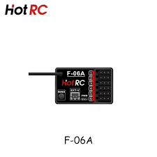 |

---

## Mechanical & Structural

The chassis is built from the acclaimed 3D files by Mr. Baddeley. Slip ring sits inside the dome rotation axis.

| Component | Qty | Role |
| :--- | :---: | :--- |
| 3D Chassis (Mr. Baddeley "Big Baby" files) | 1 | Full 3D-printed astromech body, dome, legs |
| [3D Print Assembly Guide](mechanical/3d-print-assembly.md) | — | Build order + hardware kit |

---

> [!NOTE]
> For wiring detail and signal paths, see the [Interactive Electrical Schematic](architecture/electrical-schematic.md) and the [Node Pinout Guide](architecture/node-pinout-guide.md).
> The audio module is shown as a labeled SVG pinout diagram (`assets/dy-hv20t-module.svg`) until a hardware photo is taken.
> Node 3 runs **stock WLED 0.15.4** on a **classic ESP32D** (not the S3 Mini used on Nodes 1 + 2). See the [Node 3 LED Hub page](architecture/node-3-led-distribution.md) for full WLED config.

[View Master Schematic](architecture/electrical-schematic.md) | [View Node Pinout Guide](architecture/node-pinout-guide.md) | [View Battery Runtime Guide](maintenance/battery-runtime-guide.md)
