# <i data-lucide="workflow"></i> Behavioral Automations

> **TECHNICAL SPECIFICATIONS** | **NODE 1 MASTER LOGIC** | **MULTI-NODE SYNC**

Wee2-D2's autonomous personality is driven by a series of high-fidelity behavioral scripts residing on **Node 1 (Dome Master)**. These scripts synchronize dome movement with **Node 2 (Audio)** and **Node 3 (LEDs)** to create seamless cinematic experiences.

## Animation Catalog (v2.6.9)

| Animation | Dashboard ID | Audio Link | LED Preset | Motion Pattern |
| :--- | :---: | :---: | :---: | :--- |
| **1977 Idle** | `0x01` | `14/01` | `1` | Static Center / Level 0.0 |
| **Angry Tantrum** | `0x02` | `14/02` | `3` | High-frequency Jitter |
| **Dance Party** | `0x03` | `14/17` | `10` | Wide Rhythmic Sways |
| **Cantina Band** | `0x04` | `13/02` | `10 → 14 → 3` | 3-Phase Choreography |
| **Emergency Stop** | `0x99` | `14/99` | `0` | Immediate Brake |

---

## Technical Deep-Dive: The Cantina Sync

The "Cantina Band" animation (ID 0x04) is the most complex behavioral script in the current firmware. It utilizes a **545ms beat-interval** to harmonize dome sways with logic light pulses.

### Synchronization Logic (545ms Interval)

```mermaid
sequenceDiagram
    participant N1 as Node 1 (Master)
    participant N2 as Node 2 (Audio)
    participant N3 as Node 3 (WLED)
    
    Note over N1: animation_cantina start
    N1->>N2: ESP-NOW: trigger_sound(0x04)
    N1->>N3: Serial: set_light_preset(10)
    Note over N2: DFPlayer Plays 13/02 (Cantina)
    
    loop Phase 1: Intro (4 Beats)
        N1->>N1: Servo: 0.25 (Left)
        rect rgb(0, 0, 80)
        Note right of N3: Disco Mode Scan
        end
        N1->>N1: Delay 545ms
        N1->>N1: Servo: -0.25 (Right)
        N1->>N1: Delay 545ms
    end
    
    N1->>N3: Serial: set_light_preset(14)
    Note over N3: Transition to Celebration Shimmer
    
    loop Phase 2: Main Groove (5 Beats)
        N1->>N1: Widest Sways (0.50)
        N1->>N1: Double-Tap Pulse
    end
    
    N1->>N3: Serial: set_light_preset(3)
    Note over N3: Alert Red Flash Finale
```

---

## Operational Procedures

### Dome Speed Tuning
The intensity of all animations is scaled by the `dome_speed_tuning` global variable. This can be adjusted via the **Neural Dashboard** (0.10 to 1.00).

### Emergency Stop (E-Stop)
Triggering the **Emergency Stop** (ID 0x99) immediately stops any running script, brakes the dome motor (Level 0.0), kills all audio, and sets the LED array to **Preset 0 (All Off)**.