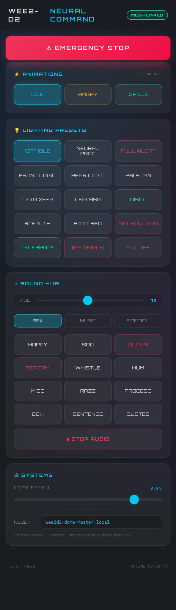

*(Alpha build screenshot)*

# <i data-lucide="layout"></i> Dashboard & App

> **TECHNICAL SPECIFICATIONS** | **OPERATOR CONTROL SURFACES** | **WEB DASHBOARD + MOBILE APP**

This page covers the two software ways to control Wee2-D2: the **on-droid web dashboard** (host any browser on the same Wi-Fi network) and the **mobile app over Bluetooth** (browser PWA + native Android APK). The HOTRC remotes are documented separately under [HOTRC DS-600](../hardware/hotrc-ds600-manual.md).

The two surfaces share the same control vocabulary — same animations, same reactions, same lighting presets, same E-Stop. Pick whichever fits the setting: dashboard when you're on Wi-Fi, app when you're walking the floor at a venue.

---

## 1. Web Dashboard (on-droid)

Hosted directly on the droid (Node 2). Browse to it from any phone, tablet, or laptop on the same local network — no install, no setup.

### Access

| Path | When to use |
| :--- | :--- |
| `http://wee2d2-sound-hub.local` | Default. Works on any network where mDNS is enabled. |
| `http://<droid-ip>` | Fallback if mDNS is blocked (some guest networks). |
| `http://192.168.4.1` after joining `Wee2d2-Sound-Setup` AP | Fallback when no Wi-Fi network is configured (first boot). |

### What you can do

- Trigger any production performance (Idle, Angry, Dance, Cantina, Birthday, Imperial March)
- Trigger any reaction (Wolf Whistle, Razz, Annoyed, Thinking, Excited)
- Pick from the 15 cinematic [lighting presets](led-system.md)
- Play a random sound from any [audio category](audio-system.md) or specific named tracks
- Adjust dome speed live
- Adjust volume live (capped at 26/30 — see [DY-HV20T safety](../hardware/dy-hv20t-manual.md))
- Watch droid telemetry: Node 1 online flag, currently playing animation, last reaction
- E-Stop (cuts dome motion and silences audio in one tap)

---

## 2. Mobile App (Bluetooth)

The mobile app talks to the droid over Bluetooth via a small dedicated BLE controller board inside the droid. It works without Wi-Fi — that's the whole point.

The app ships in two forms:

| Form | What it is | When to use |
| :--- | :--- | :--- |
| **Browser PWA** | Web app, no install | Operator on a desktop or Android Chrome |
| **Android APK** | Installed app on the operator's Pixel | At-venue use, tap home-screen icon, sub-2 s reconnect |

Both share the same code and the same control vocabulary as the dashboard above. The native APK exists because Bluetooth reconnect on stable browser Chrome is not reliable enough for walking-the-floor use.

### Why a dedicated BLE board

Earlier prototypes ran Bluetooth on the same chip that hosts the dashboard. The two workloads competed for the 2.4 GHz radio and dashboard responsiveness suffered. The dedicated BLE controller runs Bluetooth only — never touches Wi-Fi — and stays available even when the dashboard is busy.

### Range and connection

| | Value |
| :--- | :--- |
| **Range** | ~10 m line-of-sight |
| **Reconnect** | Silent when in range (no device picker each time) |
| **Concurrent clients** | One at a time |
| **Wi-Fi required** | No |
| **Internet required** | No |

### Browser support (PWA)

| Browser | Desktop | Android |
| :--- | :---: | :---: |
| Chrome 56+ | yes | yes |
| Edge 79+ | yes | yes |
| Firefox | no | no |
| Safari (incl. iOS) | no | no |

Web Bluetooth is required. Firefox and Safari do not implement it. iOS is not on the roadmap.

---

## 3. Side-by-Side: When to Use Which

| Situation | Best surface |
| :--- | :--- |
| Setting up the droid at home, debugging | **Web dashboard** — full telemetry view, easy on a laptop |
| Walking the floor at a convention | **Mobile app (APK)** — Bluetooth keeps working when venue Wi-Fi is patchy or absent |
| Lending control to someone at the booth | **Web dashboard** — open URL on their phone, hand back |
| Phone connected but no Wi-Fi | **Mobile app** — Bluetooth-only by design |
| Pure remote piloting (no sounds / lights needed) | **HOTRC remote** — see the [HOTRC manuals](../hardware/hotrc-ds600-manual.md) |
| Emergency stop | All three (dashboard, app, RC button) — single tap on any |

---

## 4. Safety

- **Volume cap** — every surface (dashboard, app, RC) enforces the 26/30 maximum. You cannot push past it from any input.
- **E-Stop fan-out** — pressing E-Stop on any surface stops dome motion AND silences audio in a single command. Single press, both subsystems halted.
- **Mesh dropout pause** — if the dashboard / app loses contact with the droid for more than ~100 ms, dome motion pauses until the link recovers.

---

## 5. Future Direction

Long-term, the goal is one-tap install for the app (Capacitor APK from a download page) and a pre-paired BLE flow so the first launch goes straight to a connected state. The web dashboard already has this story sorted — open URL, you're in. Mobile app delivery is the next hardening pass.

The app and dashboard codebases live in separate repositories (`wee2d2-app` and the firmware repository, respectively). Both are currently in **alpha** state — the control vocabulary is stable but the visual styling will keep refining.

---

[View Behaviour & Personality](animation-framework.md) | [View HOTRC DS-600 Remote](../hardware/hotrc-ds600-manual.md) | [View Flashing the Firmware](../maintenance/flashing-firmware.md)
