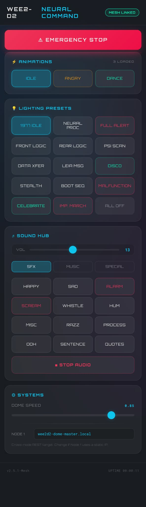
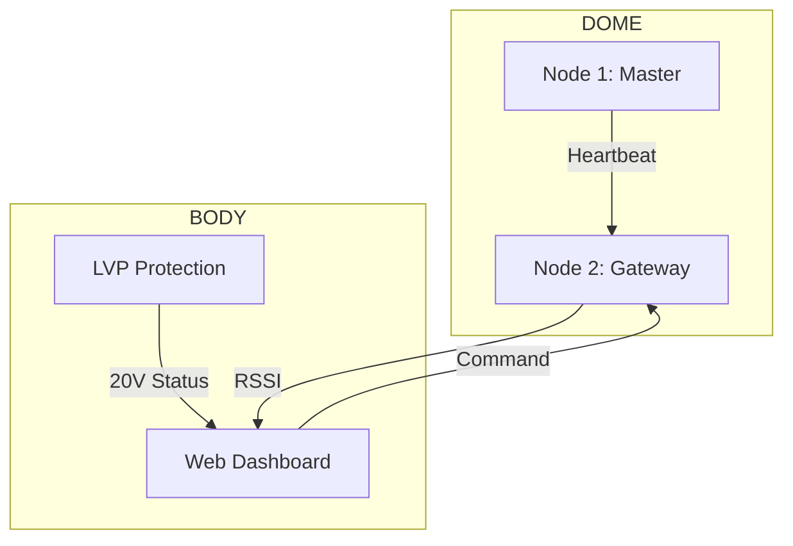

*(Alpha Build S3-V3 Screenshot)*

# <i data-lucide="layout"></i> Web Control Dashboard

> **TECHNICAL SPECIFICATIONS** | **ESPHome Web Server (v3)** | **mDNS Gateway** | **ESP-NOW Relay Enabled**

> [!IMPORTANT]
> **Alpha Release**: This interface is currently in an experimental state. All vitals and control scripts are subject to clinical recalibration as signal stability is verified in the field.

The **Web Control Dashboard** is the droid's primary command-and-control gateway. Hosted locally on **Node 2 (Sound Hub)**, it provides a high-fidelity, glassmorphic interface for real-time vitals monitoring, cinematic lighting control, and Animation triggers via a specialized ESP-NOW relay mesh.

---

## 1. Interface Architecture: The Neural Gateway

Unlike standard IoT interfaces that require a central router, the Wee2-D2 dashboard is designed for **Field Resiliency**. It utilizes a hybrid communication model to ensure control even in environments with high WiFi interference.

- **Frontend**: Served by Node 2 via a specialized **DashboardHandler** in the `esp-idf` framework.
- **Relay Bridge**: Commands issued via the Web UI are received by Node 2 over HTTP and immediately broadcast to the **Node Mesh** via **ESP-NOW** (@ 2.4GHz).
- **Latency**: Sub-50ms command execution from "Tap to Action."

---

## 2. Command & Control Grid

The interface is partitioned into logical modules to maximize operational efficiency during droid deployment.

### 🔊 Sound & Feedback Grid
The dashboard provides a direct interface to the **DFPlayer Mini** sound folders.
- **Dynamic Folders (1-12)**: Access to the happy, sad, and procedural quote banks.
- **Music Library (Folder 13)**: Direct triggers for the Star Wars Theme and Cantina tracks.
- **Special Effects (Folder 14)**: Droid startup, short circuits, and motivator failure sequences.

### 💡 Lighting & Cinematic Presets
The dashboard mirrors the **Node 3 (WLED)** preset library, allowing for instant "Global Look" changes.

| Preset Name | ID | Visual Impact |
| :--- | :---: | :--- |
| **1977 Idle** | 1 | Classic logic matrix pattern (Slow sweep). |
| **Neural Processing**| 2 | High-speed data burst logic. |
| **Stealth** | 11 | Complete light blackout for low-profile ops. |
| **Full Alert** | 3 | High-frequency red/blue PSI pulse. |
| **Disco Mode** | 10 | Multicolored kinetic cycling logic. |

---

## 3. Real-Time Vitals Monitor

The dashboard provides a clinical view of the droid's system health, pulling telemetry from across the node mesh.

- **Node 1 Heartbeat**: Displays the link status between the Body and Dome hubs.
- **RSSI Monitoring**: Real-time signal strength of the operator's connection.
- **System Uptime**: Diagnostic tracking of the logical runtime.

---

## 4. Access Protocols

The dashboard can be accessed via any modern browser on the local network. No external apps or internet connection required.

1.  **Primary Access**: `http://wee2d2.local/dash` (mDNS)
2.  **IP Access**: `http://192.168.1.XX/dash` (Static mapping recommended)
3.  **Fallback AP Mode**: If no network is discovered, connect to `Wee2d2-Sound-Setup` and navigate to `http://192.168.4.1/dash`.

---

[View Master Node Pinout](node-pinout-guide.md) | [View Operation & Maintenance](../maintenance/manuals-and-files.md)
