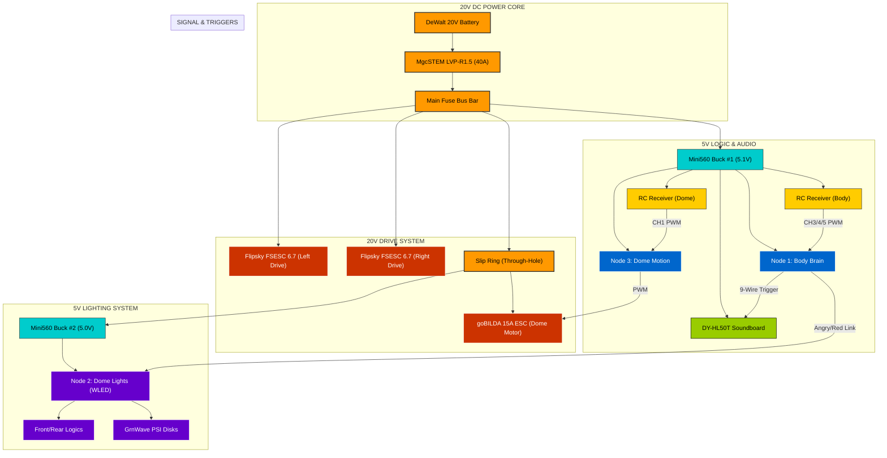

# ⚡ Droid Electrical Schematic

This document provides a high-fidelity visual and technical map of the Wee2-D2 electrical system. 

## 🗺️ Visual HUD Block Diagram

---

## 🧠 System Architecture (Mermaid)

---

## 📌 Pinout Lookup Tables

### **Node 1: Body Brain (ESP32)**
Used for RC input interpretation and soundboard triggering.

| Component | Pin (GPIO) | Mode | Notes |
| :--- | :---: | :---: | :--- |
| **Status LED** | GPIO2 | Output | Heartbeat Blinker |
| **RC CH3 Input** | GPIO25 | Input | PWM Pulse Width |
| **RC CH4 Input** | GPIO32 | Input | PWM Pulse Width |
| **RC CH5 Input** | GPIO33 | Input | Bank Cycle Switch |
| **Sound S1-S9** | 4,5,16,17,18,19,21,22,23 | Output | **Active LOW** (Trigger) |
| **Angry Link** | GPIO13 | Output | To Node 2 Button Input |

### **Node 3: Dome Motion (ESP32)**
Controls the 360° dome rotation motor.

| Component | Pin (GPIO) | Mode | Notes |
| :--- | :---: | :---: | :--- |
| **RC Steering** | GPIO4 | Input | From Receiver #2 |
| **Dome ESC** | GPIO18 | Output | PWM Signal (50Hz) |

### **Node 2: Dome Lights (WLED)**
Addressable LEDs for logics and PSIs.

| Component | Pin (GPIO) | Mode | Notes |
| :--- | :---: | :---: | :--- |
| **Front Logic** | GPIO16 | Output | Data Pin A |
| **Rear Logic** | GPIO2 | Output | Data Pin B |
| **Angry Link** | GPIO4 | Input | From Node 1 Trigger |

---

## 🛡️ Best Practices
*   **Common Ground**: All ESP32 grounds and Buck Converter grounds **MUST** be tied together at a central star-ground point.
*   **Signal Cleanliness**: Since the dome motor is a large DC motor, ensure logic wires are positioned away from the main motor leads to prevent EMI noise.
