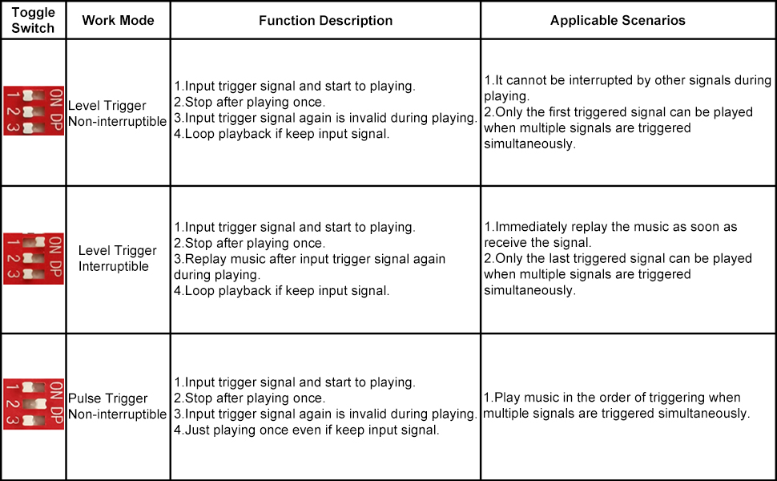
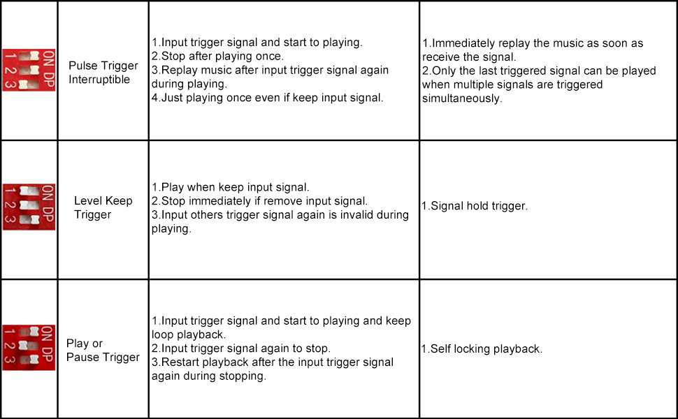
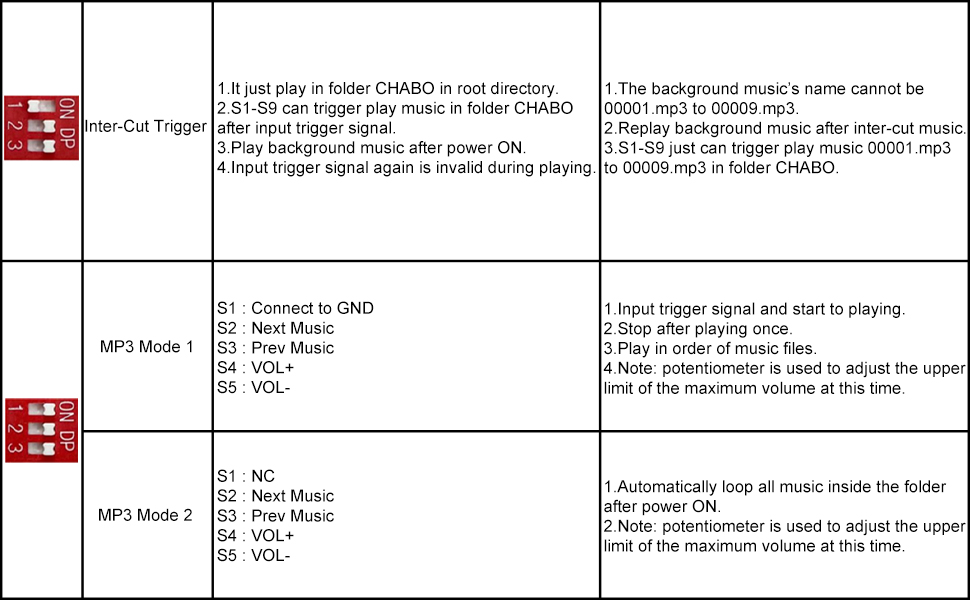
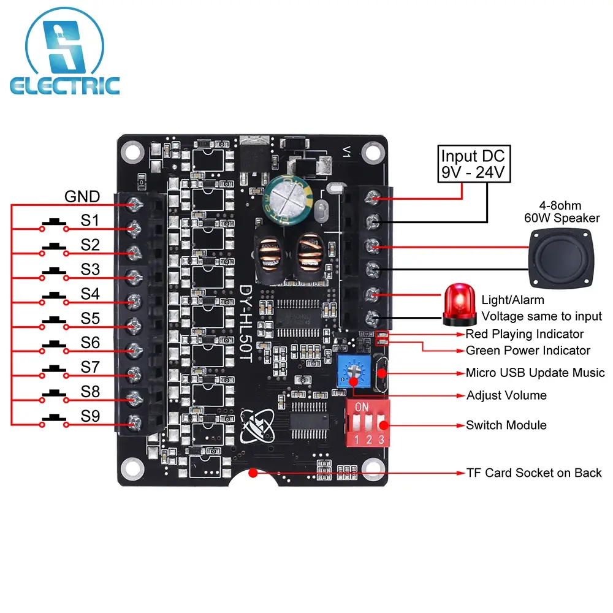
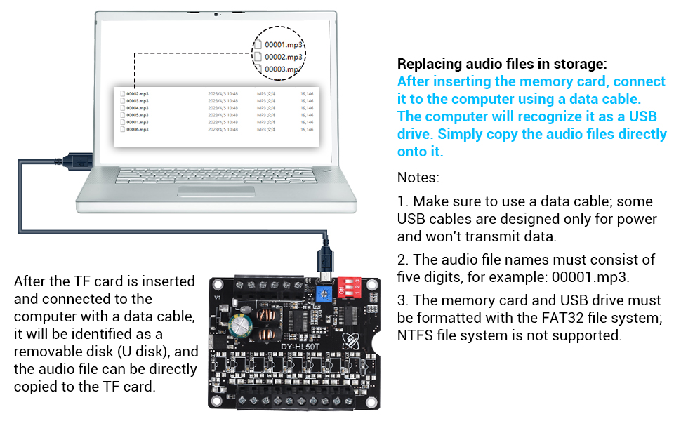
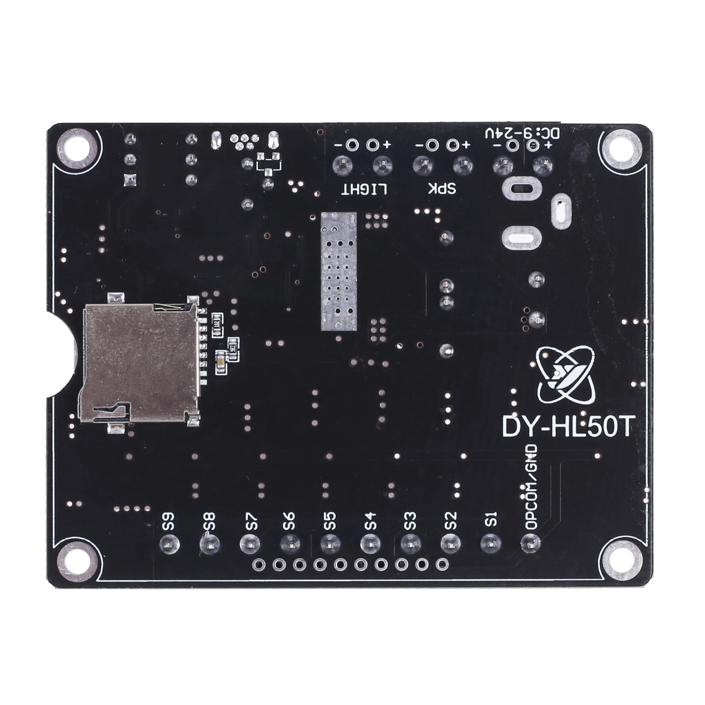

# 🏛️ IMPERIAL DATABANK: PEMENOL 60W AUDIO
> **DECRYPTED DATA REPOSITORY** | **SERIAL: PEMENOL-DY-HL50T**

The **PEMENOL 60W** (DY-HL50T) is the primary voice playback module for Wee2-D2. It features a powerful 60W Class D mono amplifier.

### Common Droid Configurations:
| Switch 1 | Switch 2 | Switch 3 | Mode | Behavior |
| :---: | :---: | :---: | :--- | :--- |
| **OFF** | **OFF** | **OFF** | Level Non-Interr. | Plays once; cannot be interrupted. |
| **ON** | **OFF** | **OFF** | Level Interr. | Plays once; restarts if triggered again. |
| **ON** | **ON** | **OFF** | Pulse Non-Interr. | Plays once; plays in order if multiple triggers. |
| **OFF** | **OFF** | **ON** | MP3 Mode 2 | Automatic loop all folder files after Power ON. |

## 🔌 Pinout & Wiring

*   **VCC/GND**: 9-24V Power Input.
*   **SPK+/SPK-**: Speaker Output.
*   **S1 - S9**: Trigger inputs (Active Low).
*   **COM**: Common Ground for triggers.

## 📐 Dimensions & PCB Layout

