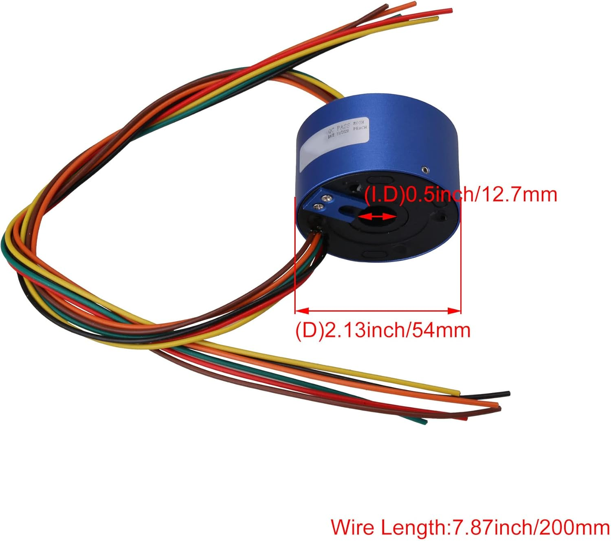

# <i data-lucide="refresh-cw"></i> CNBTR Slip Ring Manual

> **TECHNICAL SPECIFICATIONS** | **SYSTEM: POWER GRID** | **MODEL: CNBTR 6-CIRCUIT 20A**

The ganged trunk for the Wee2-D2 project passes through a central 6-circuit slip ring. This hardware ensures that the aluminum dome assembly can rotate 360 degrees without tangling the high-current power wires.

---

## Hardware Specifications (Structural Focus)

The **CNBTR 6-Circuit** slip ring is a high-current rotational connector with a standard 12.5mm outer diameter. It is the primary bridge between the body logic and the dome logic stacks.

| Parameter | Specification | Value |
| :--- | :--- | :--- |
| **Model** | 6-Circuit High-Current | CNBTR |
| **Max Current** | 10A Per Circuit | 20A Ganged |
| **Voltage** | 240V AC/DC (Max) | 20V System |
| **Rotation** | 360 Degree Continuous | High Speed |
| **Wire Gauge** | 14AWG (Teflon) | Low Friction |

---

## Logic Integration: Dual-Circuit Strategy

To minimize signal noise and maximize current carrying capacity, the slip ring uses a **Paired Ganged Architecture**. This strategy doubles the current-carrying ability for the 20V battery trunk.

These settings are verified in the [Power Architecture](../architecture/power-architecture.md).

- **Ganged Positive Trunk**: Circuit 1 + Circuit 2 (firmware/production/node-1-dome-motion.yaml:24).
- **Ganged Negative Trunk**: Circuit 3 + Circuit 4 (Common GND).
- **Reserved Logic**: Circuit 5 + Circuit 6 (Currently idle for future expansion).
- **Noise Isolation**: The radio mesh (ESP-NOW) eliminates the need for logic-level pins through the slip ring, preventing EMI interference.

---

## Physical Hookup & Wiring

The slip ring is mounted within the central axis of the goBILDA dome joint. All wires are connected using standard Wago hubs and XT60 connectors for reliability.

1. **Input (Body Side)**: From the Body Wago Hub (20V Trunk).
2. **Output (Dome Side)**: To the Dome Wago Hub (20V Logic/LED Rails).
3. **Mounting**: Press-fitted into the 3D-printed slip ring holder.
4. **Stress Relief**: Ensure the rotating wires have an "expansion loop" to prevent physical fatigue during high-speed rotation.

---

## Hardware Calibration

To ensure the slip ring operates without creating "electrical noise" in the dome logic, the contacts must be free of significant rotational resistance.

- **Friction**: The teflon-coated wires are low-friction, but ensure they are not pinched by the 32mm grid mount.
- **Verification**: Regularly check the resistance across the ganged trunk. An increase in resistance can cause "voltage sag" in the Node 1 logic.
- **Thermal Policy**: Although rated for 20A ganged, pulling >15A continuously can cause localized heating. monitor the slip ring temperature during long cinematic sequences.

---

[View Master Schematic](../architecture/electrical-schematic.md) | [View Power Architecture](../architecture/power-architecture.md)