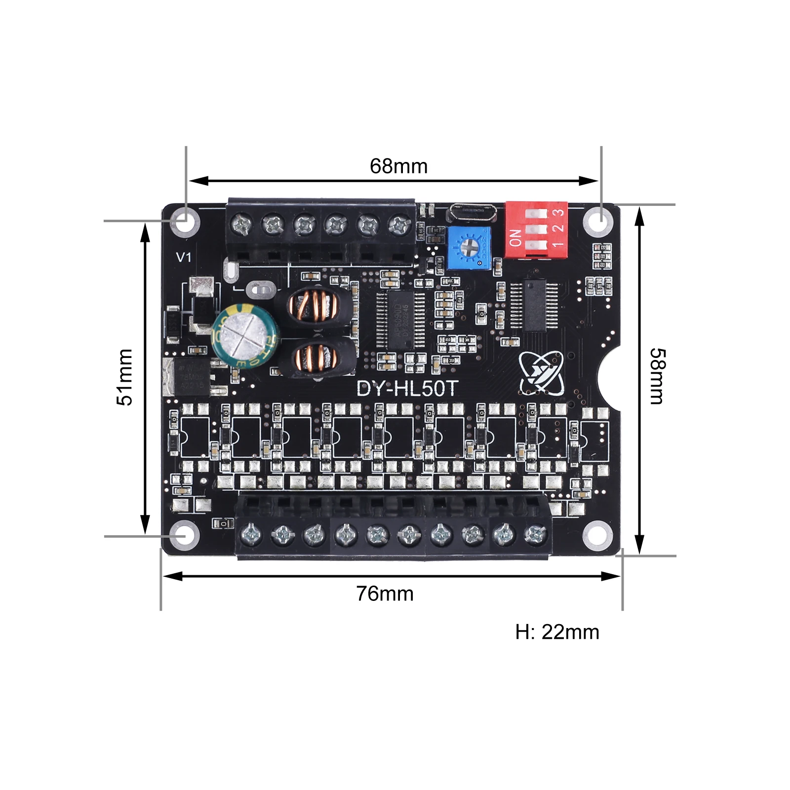

# 🏛️ IMPERIAL DATABANK: DFPLAYER MINI (MP3-TF-16P)
> **DECRYPTED DATA REPOSITORY**

The **DFPlayer Mini** is the primary audio playback module for Wee2-D2. It is a compact, high-performance MP3 serial hub that interfaces directly with the Body Audio Hub (MCU 1) via UART.

## 🛠️ Technical Specifications
| Attribute | Specification |
| :--- | :--- |
| **Operating Voltage** | 3.2V - 5.0V DC (Standard: 5V) |
| **Communication** | UART (Default: 9600 Baud) |
| **Format Support** | MP3, WAV, WMA |
| **Storage** | Micro-SD Card (Up to 32GB, FAT32) |
| **Output** | 24-bit DAC; Mono 3W (Internal) / Stereo Out (Pads) |

---

## 🔌 Pinout Mapping
The DFPlayer Mini uses a standard 16-pin dual-inline layout.

| Pin | Name | Role |
| :---: | :--- | :--- |
| **1** | **VCC** | Power In (+5V) |
| **2** | **RX** | Serial Data In (From S3 TX) |
| **3** | **TX** | Serial Data Out (To S3 RX) |
| **4** | **DAC_R** | Audio Out (Right Channel) |
| **5** | **DAC_L** | Audio Out (Left Channel) |
| **6** | **SPK1** | Speaker Positive (+) |
| **7** | **GND** | Power Ground (-) |
| **8** | **SPK2** | Speaker Negative (-) |

---

## 💾 SD Card Structure
To ensure Behavioral Sync, the SD card **MUST** be formatted as FAT32 and use the following naming convention:

1.  **Folders**: Two-digit naming (`01`, `02`, `03`...).
2.  **Files**: Three-digit prefix (`001.mp3`, `002_beep.mp3`...).

---

## 🛡️ Best Practices
*   **Resistor Padding**: A 1K ohm resistor is recommended on the RX line between the ESP32 and the DFPlayer to suppress serial noise and protect the logic levels.
*   **Isolation**: Power the DFPlayer from a clean 5.1V logic buck converter to prevent digital "pops" from the motor rails.
*   **Star Ground**: Ensure the DFPlayer shares a common ground with its controlling MCU and the TPA3118 amplifier to prevent audio hum.

---

**Related Hubs:**
*   [Audio & Behavioral Guide](../../capabilities/lights-and-sounds/audio-system.md)
*   [Body Wiring Guide](../../architecture/body-wiring-guide.md)
