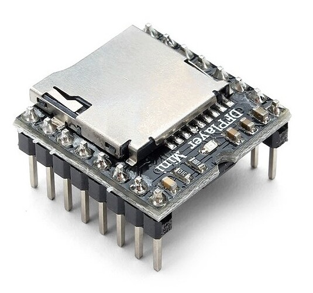
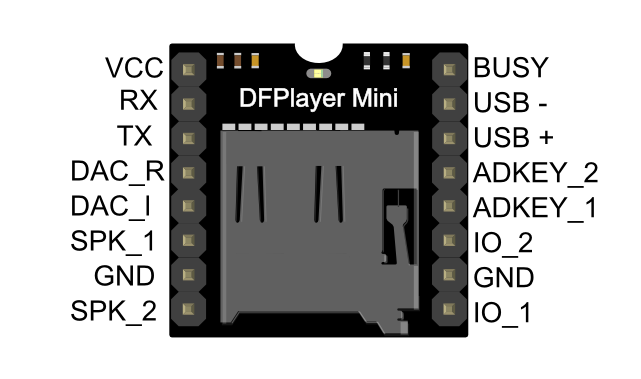

#  DFPlayer Mini (MP3-TF-16P)
> **HARDWARE SPECIFICATION** | **NODE 1: SOUND HUB INTEGRATION**

The **DFPlayer Mini** is a specialized, serial-controlled MP3 module that serves as the "Voice" of Wee2-D2. It is managed by **Node 1 (Sound Hub)** via a low-latency UART serial link.

##  Module Overview
- **Storage**: Micro SD card (up to 32GB, **FAT32**).
- **Control**: 9600 Baud Serial (TTL).
- **Output**: 2x 3W Peak Analog or direct DAC pass-through to **TPA3118 Amplifier**.
- **Visual ID**: 

---

##  Pinout Reference
The following pinout is used for integration into the Node 1 (Sound Hub) logic rail.

| Pin | Name | Role | Connection |
| :---: | :--- | :--- | :--- |
| **1** | **VCC** | Power In | 5.1V Stable Logic Rail |
| **2** | **RX** | Data In | Node 1 (GPIO 17 / Yellow) |
| **3** | **TX** | Data Out | Node 1 (GPIO 16 / Green) |
| **6** | **SPK1** | Audio (+) | TPA3118 Audio In |
| **7** | **GND** | Ground | Common Star Ground |
| **8** | **SPK2** | Audio (-) | TPA3118 Audio In |

---

##  SD Card Logic & Formatting
For the DFPlayer to function in the "distributed behavior" mesh, the SD card **MUST** be formatted to FAT32 and use the industrial directory structure.

### Folder Mapping
- `Folder 01`: **Bank 1 (Standard)** - Happy, inquisitive chirps.
- `Folder 02`: **Bank 2 (Patrol)** - Static, processing hums.
- `Folder 03`: **Bank 3 (High Alert)** - Red-alert alarms and screams.
- `Folder 04`: **Bank 4 (Events)** - Specific convention/interaction SFX.

### Filename Protocol
Tracks must be named with a 3-digit prefix (e.g., `001_beep.mp3`) to enable rapid track-seeking by the ESPHome firmware.

---

##  Calibration & Diagnostics
- **UART Heartbeat**: If the Node 1 logo pulses **Yellow**, it indicates the DFPlayer is disconnected or the SD card is unreadable.
- **Volume Limit**: WEE2-D2 firmware limits the DFPlayer volume to **26/30** to prevent clipping on the TPA3118 gain stage.

**Further Resources:**
- [DFPlayer Mini Official Manual](../manuals/dfplayer-mini-manual.pdf)
- [Node 1: Sound Hub Spec](../architecture/node-1-sound-hub-spec.md)
