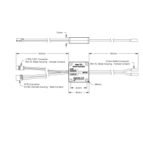

# <i data-lucide="settings"></i> goBILDA Drive & Motion
> **TECHNICAL SPECIFICATIONS**

This entry covers the high-torque dome rotation motor and its dedicated speed controller.

## goBILDA 1x15A Speed Controller
The **goBILDA 1x15A** is a compact, high-reliability brushed DC motor controller used for precise dome positioning.

### Technical Specifications
| Feature | Value |
| :--- | :--- |
| **Weight** | 41g (1.44 oz) |
| **Channels** | 1 |
| **Motor Type** | Brushed DC |
| **Control Input** | RC (1050-1950μsec PWM) |
| **Voltage (Rec.)** | 12 - 24VDC |
| **Voltage (Limit)** | 9 - 30VDC |
| **Max Current** | 15A Continuous / 25A Throttle |
| **BEC Output** | 6VDC @ 3A |

### Wiring & Interface
* **12-24V In**: Plug a battery or power supply (12-24V) into the XT30 connector. (Keyed for polarity protection).
* **Motor**: Connects via 3.5mm bullet connectors. Brushed DC motors are reversible; if spinning in the wrong direction, swap the red and black wires.
* **RC/Data Input**: 
 * **Receiver**: Plugs into white/red/black 3-wire connector.
 * **Node 3 Wiring**: Connected to the **Node 3: Dome ESP32** data pin.
 * **Logic**: Responds proportionally to signals between 1050-1950μs.

> [!IMPORTANT]
> The built-in 6V BEC (3A) can power your receiver or ESP32 logic via the red wire if needed. Ensure the data pin is connected to the appropriate GPIO on the ESP32.

### Programming & Calibration
* **Center Point**: Typically `1500μs`.
* **Deadband**: The ESC is designed to achieve full power without reprogramming on most standard radio systems.

## goBILDA 5203 Yellow Jacket Motor
The **Yellow Jacket** series features steel planetary gears and integrated encoders.

### Technical Specifications (50.9:1 Model)
| Feature | Value |
| :--- | :--- |
| **Gear Ratio** | 50.9:1 |
| **No-Load Speed** | 117 RPM @ 12V |
| **Stall Torque** | 68.4 kg.cm |
| **Encoder Type** | Magnetic (Hall Effect) |
| **Encoder Voltage**| 3.3 - 5 VDC |
| **Output Shaft** | 8mm REX® profile |

### Mounting
* **Grid Pattern**: Four M4 threaded holes on a 32mm square (8mm goBILDA grid).
* **Hardware**: M4 screws (12mm case thickness).
* **Stacking**: Multiple controllers can be stacked using the same mounting holes.

## Protection Systems
* **Reverse Voltage**: Protection against accidental polarity reversal on input.
* **Over-Current**: Disconnects if current exceeds safe thresholds.
* **Thermal**: Automatic shutdown if the controller exceeds operating temperature limits.
