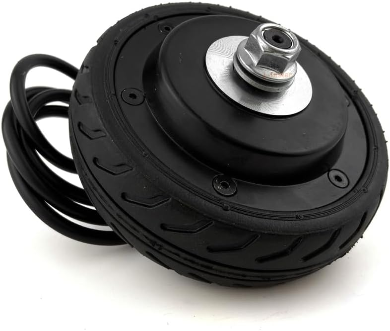

# <i data-lucide="cog"></i> FLD-5 Hub Motor Manual

> **TECHNICAL SPECIFICATIONS** | **SYSTEM: BODY DRIVE** | **MODEL: L-FASTER FLD-5 HUB MOTOR**

The body drive for the Wee2-D2 project is managed by two direct-drive hub motors and two Flipsky motor controllers (VESC®). This manual catalogs the physical configuration and logic integration for the body drive.

---

## Motor Specifications (Hardware Focus)

The **FLD-5 Series** is a brushless direct-drive motor that combines the tire and motor into a single high-efficiency assembly. These motors are optimized for smooth, high-torque operation on convention floors.

| Parameter | Specification | Value |
| :--- | :--- | :--- |
| **Model** | L-faster FLD-5 (Hub) | Direct-Drive |
| **Diameter** | 5 Inches (127mm) | Solid Rubber |
| **Voltage** | 24V-36V (Running at 20V) | DC Brushless |
| **Pole Pairs** | 15 (Standard China Hub) | Outer Rotor |
| **Hall Sensors** | 3 (120 Degree) | JST-ZH 6-Pin |

---

## Controller Integration: Flipsky FSESC 6.7 Pro

The hub motors are driven by two **Flipsky 6.7 Pro** motor controllers configured for FOC operation. These controllers communicate via PWM signals from Node 1 (Dome Master).

These settings are verified in the `v2.6.0-Dashboard` firmware sequence.

- **Limit**: **15.0A Software Clamp** (firmware/esc-configs/left-motor-settings.xml).
- **Control**: FOC (Field Oriented Control).
- **Communication**: PPM (Pulse Position Modulation) at 50Hz.
- **Safety**: 16.5V Battery Cutoff (High-current protection for DeWalt packs).

---

## Physical Hookup & Wiring

The hub motor is connected to the FSESC using three 4.0mm Gold Bullet connectors (Phase Wires) and a 6-pin JST sensor cable.

1. **Phase Wires**: UVW (Yellow/Green/Blue) - High Current.
2. **Hall Sensor**: 6-Pin Connector (Red/Black/Temperature/Hub Signals).
3. **Power In**: XT60 Connection (XT60 to Wago Hub Logic).
4. **Trunk Connection**: 20V Raw Trunk In (MgcSTEM Protected).

---

## Hardware Calibration

To ensure the droid drives straight and handles torque correctly, a full hall-sensor calibration must be performed using the VESC Tool.

- **FOC Smoothing**: Ensure the `FOC Resistance` and `Inductance` values match the motor specs in the XML configuration. Incorrect values can cause motor "grinding" or jitter.
- **Tire Cleanliness**: Solid rubber tires perform best when cleaned with IPA to remove wax and dust from smooth convention surfaces.
- **Tension**: Regularly check the M8 axle nuts for tightness. A loose axle can damage the motor cable entry point.

---

[View Master Schematic](../architecture/electrical-schematic.md) | [View Power Architecture](../architecture/power-architecture.md)
