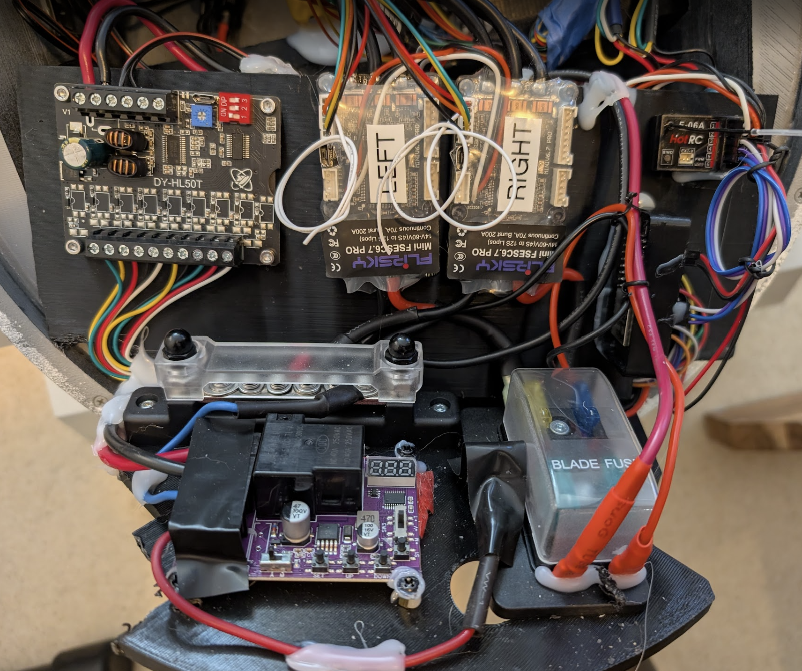
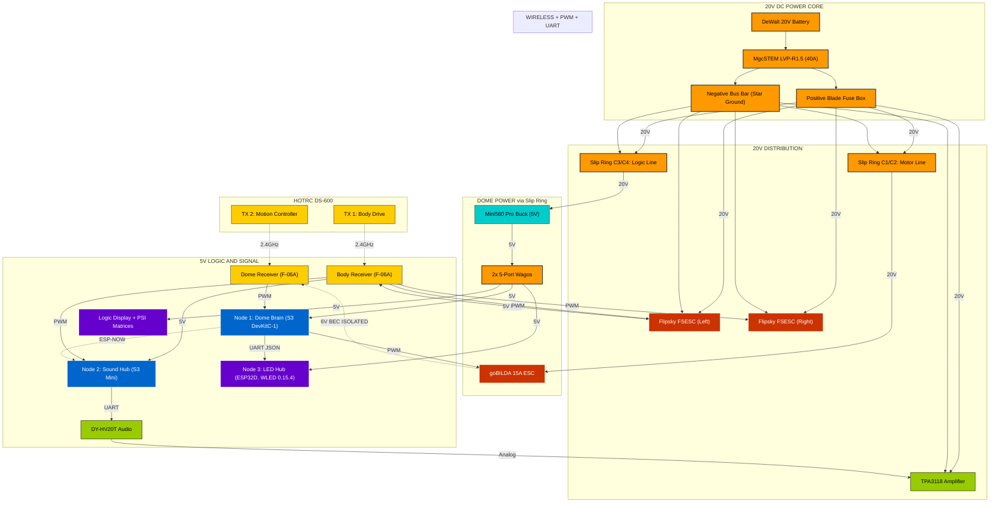

# <i data-lucide="zap"></i> Droid Electrical Schematic

> **TECHNICAL SPECIFICATIONS** | **SYSTEM: WEE2-D2 ELECTRICAL** | **VERIFIED AGAINST FIRMWARE v2.12.1**

This document provides a high-fidelity visual and technical map of the Wee2-D2 electrical system.

---

## <i data-lucide="circuit-board"></i> Interactive System Architecture

> [!TIP]
> **INTERACTIVE INTERFACE**: Click any component node to open its technical manual.

---

## <i data-lucide="pin"></i> Pinout Lookup Tables

### Node 1: Dome Brain (ESP32-S3 DevKitC-1, N4R2)

Primary autonomy controller. Drives the dome motor and originates every animation. Bridges to WLED over UART and relays ESP-NOW to Node 2.

| Component | Pin (GPIO) | Mode | Notes |
| :--- | :---: | :---: | :--- |
| **Dome Motor** | 7 | PWM Output | To goBILDA 15A ESC (50 Hz) |
| **RC CH1 (Stick)** | 4 | Input (PWM) | From Receiver 2 |
| **RC CH3 (Perf Cycle)** | 1 | Input (RC) | Performance cycle button |
| **RC CH4 (Random React)** | 6 | Input (RC) | Random reaction button |
| **RC CH5 (E-Stop)** | 2 | Input (RC) | Hard-stop relay |
| **UART to WLED** | 5 | Output (UART TX) | JSON preset push @ 115200 baud |
| **ESP-NOW** | — | Wireless | Bidirectional relay with Node 2 |
| **Status LED** | 47 | Output | S3 internal NeoPixel |

### Node 2: Sound Hub (ESP32-S3 Super Mini)

DY-HV20T audio driver, web dashboard host, BLE bridge endpoint, ESP-NOW relay TX, heartbeat monitor.

| Component | Pin (GPIO) | Mode | Notes |
| :--- | :---: | :---: | :--- |
| **DY-HV20T TX** | 12 | Output (UART TX) | Audio module RX @ 9600 baud |
| **DY-HV20T RX** | 13 | Input (UART RX) | Audio module TX @ 9600 baud |
| **RC CH3 (Vol Up)** | 5 | Input (RC) | Volume increment |
| **RC CH4 (E-Stop)** | 4 | Input (RC) | Hard-stop relay |
| **RC CH5 (Vol Down)** | 6 | Input (RC) | Volume decrement |
| **ESP-NOW** | — | Wireless | Bidirectional relay with Node 1 |
| **BLE** | — | Wireless | Slice 1B command bridge from app |
| **Status LED** | 47 | Output | S3 internal NeoPixel |

### Node 3: LED Hub (ESP32D DevKit, classic ESP32 running WLED 0.15.4)

Dedicated 4-strip LED controller. No firmware authored here — runs stock WLED 0.15.4 with project-specific `cfg.json` + `presets.json` + `ledmap.json`.

| Component | Pin (GPIO) | Mode | Notes |
| :--- | :---: | :---: | :--- |
| **Front PSI** | 16 | Output | GrnWave 76 px ring — Seg 0 |
| **Rear PSI** | 17 | Output | GrnWave 76 px ring — Seg 1 |
| **Front Logic Display** | 18 | Output | WS2812B 10x2 matrix (20 px) — Seg 2 |
| **Rear Logic Display** | 19 | Output | WS2812B 12x2 matrix (24 px) — Seg 3 |
| **UART RX** | 3 (RX0) | Input | JSON presets from Node 1 @ 115200 baud |
| **Web UI** | N/A | Wi-Fi | Port 80 (preset selection) |

---

## <i data-lucide="shield-check"></i> Best Practices

- **Common Ground**: every ESP, receiver, and ESC ground ties to a central star-ground point on the negative bus bar.
- **Dual Drive Signal Isolation**: the HOTRC DS-600 runs in Mode 1 (Mixed) — each ESC receives its own PWM. To avoid ground loops, **only ESC 1** powers the receiver; **ESC 2** connects via signal pin only.
- **Signal Cleanliness**: route logic wires away from motor leads to suppress EMI.
- **BEC Isolation**: when using the goBILDA 15A ESC, isolate its 6V red wire if the logic bus is already on 5V. Keep the black ground for signal reference.
