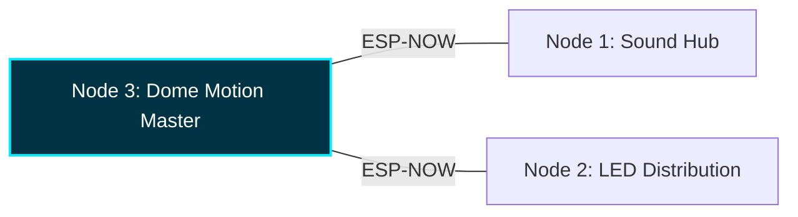

# Project Overview
> **TECHNICAL DOCUMENTATION** | **MODEL: v2.1.2-FINAL-STABLE**

This wiki serves as the central repository for the Wee2-D2 control system. It details the custom electrical architecture, distributed node-mesh firmware, and maintenance procedures used to orchestrate the droid's functional systems.

---

## Architecture: The Node Mesh
The control system is distributed across three independent ESP32 microcontrollers. This design ensures low-latency performance and isolates high-current motor noise from sensitive audio and logic circuits.

| Node Unit | Primary Specialization | Logic Framework |
| :--- | :--- | :--- |
| **Node 1** | **Sound Hub (S3 Mini)** | ESPHome (esp-idf) |
| **Node 2** | **LED Distribution (ESP32-D)** | WLED |
| **Node 3** | **Dome Motion (S3 Mini)** | ESPHome (esp-idf) |

---

## Primary Technical Resources
Quickly access the core engineering specifications for the v2.1.2 architecture:

> [!IMPORTANT]
> **[Node Pinout Guide](../../docs/architecture/node-pinout-guide.md)**  
> Master wiring and GPIO reference for all three nodes.

> [!NOTE]
> **[Electrical Schematic](../../docs/architecture/electrical-schematic.md)**  
> Details the 20V power rail and logic distribution.

> [!TIP]
> **[Bill of Materials](../../docs/bill-of-materials.md)**  
> Unified ledger and visual ID for all hardware components.

---

## Project Context
The physical chassis of Wee2-D2 utilizing the 1:1 scale engineering files developed by **Mr. Baddeley**. This documentation focuses exclusively on the custom **ESPHome** and **WLED** firmware implemented to drive the droid's functional systems.

📅 [View Maintenance Log (Changelog)](../../CHANGELOG.md)
